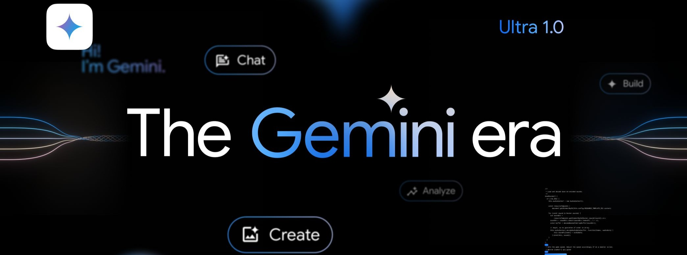

*Image Credit: Google DeepMind*
<p align="center">
    <a href="https://packagist.org/packages/derrickob/gemini-api"></a>
    <a href="https://github.com/derrickobedgiu1/gemini-api/blob/main/LICENSE"></a>
</p>

# Custom PHP Client for Google Gemini API
------

> [!IMPORTANT]
> **This library is an independent creation that tries to provide access to the latest Google Gemini API features & capabilities. It is neither endorsed nor an official library. If you're looking for Official Google Gemini API libraries, please [Check Here](https://ai.google.dev/gemini-api/docs/downloads)**.

Built with [SaloonPHP](https://github.com/saloonphp/saloon) as Core Dependency.

## Table of Contents
<!-- TOC -->
  * [# Custom PHP Client for Google Gemini API](#-custom-php-client-for-google-gemini-api)
  * [Table of Contents](#table-of-contents)
  * [Releases](#releases)
  * [Prerequisites](#prerequisites)
    * [Dependencies](#dependencies)
    * [Set up your API Key](#set-up-your-api-key)
    * [Set Up Service Account](#set-up-service-account)
  * [Installation](#installation)
    * [Environment Variables](#environment-variables)
  * [Notes](#notes)
  * [Getting Started](#getting-started)
    * [API Key](#api-key)
    * [Service Account](#service-account)
    * [Manual Credentials](#manual-credentials)
    * [Proxy](#proxy)
  * [Cached Content Resource](#cached-content-resource)
    * [create](#create)
    * [delete](#delete)
    * [get](#get)
    * [list](#list)
    * [patch](#patch)
  * [Corpora Resource](#corpora-resource)
    * [create](#create-1)
    * [delete](#delete-1)
    * [get](#get-1)
    * [list](#list-1)
    * [patch](#patch-1)
    * [query](#query)
  * [Corpora Document Resource](#corpora-document-resource)
    * [create](#create-2)
    * [delete](#delete-2)
    * [get](#get-2)
    * [list](#list-2)
    * [patch](#patch-2)
    * [query](#query-1)
  * [Corpora Document Chunk Resource](#corpora-document-chunk-resource)
    * [batchCreate](#batchcreate)
    * [batchDelete](#batchdelete)
    * [batchUpdate](#batchupdate)
    * [create](#create-3)
    * [delete](#delete-3)
    * [get](#get-3)
    * [list](#list-3)
    * [patch](#patch-3)
  * [Corpora Permission Resource](#corpora-permission-resource)
    * [create](#create-4)
    * [delete](#delete-4)
    * [get](#get-4)
    * [list](#list-4)
    * [patch](#patch-4)
  * [File Resource](#file-resource)
    * [delete](#delete-5)
    * [get](#get-5)
    * [list](#list-5)
  * [Media Resource](#media-resource)
    * [upload](#upload)
  * [Model Resource](#model-resource)
    * [batchEmbedContents](#batchembedcontents)
    * [batchEmbedText](#batchembedtext)
    * [countMessageTokens](#countmessagetokens)
    * [countTextTokens](#counttexttokens)
    * [countTokens](#counttokens)
    * [embedContent](#embedcontent)
    * [embedText](#embedtext)
    * [generateContent](#generatecontent)
    * [generateMessage](#generatemessage)
    * [generateText](#generatetext)
    * [get](#get-6)
    * [list](#list-6)
  * [Tuned Model Resource](#tuned-model-resource)
    * [create](#create-5)
    * [delete](#delete-6)
    * [generateContent](#generatecontent-1)
    * [get](#get-7)
    * [list](#list-7)
    * [patch](#patch-5)
    * [transferOwnership](#transferownership)
  * [Tuned Model Operation Resource](#tuned-model-operation-resource)
    * [cancel](#cancel)
    * [get](#get-8)
    * [list](#list-8)
  * [Tuned Model Permission Resource](#tuned-model-permission-resource)
    * [create](#create-6)
    * [delete](#delete-7)
    * [get](#get-9)
    * [list](#list-9)
    * [patch](#patch-6)
  * [Tests](#tests)
  * [Support Project](#support-project)
<!-- TOC -->

## Releases
This library uses the beta version of the Gemini API by default to try and ensure access to the most recent functionalities.

The versioning scheme follows the format `v1.x.y`: 
1. `y` is incremented for patches and backward-compatible bug fixes.
2. `x` is incremented for new features or changes that may include breaking changes.

To ensure stability **with this library**, you may consider locking your composer version to a specific release. Update your package only after reviewing the changelog and ensuring you can accommodate any breaking changes in the new release. This, however, won't apply for any upstream breaking changes if you're using the default (`v1beta`) API version.

Since there may be occasional breaking changes from the beta version, this library may end up having more frequent `x` version increments to adapt to these changes, mostly for existing broken functionalities it previously implemented.

You can also lock your usage to `v1` by explicitly defining it when constructing the Gemini class, keeping note of which features are available in `v1` and those in `v1beta`. There's a high chance you'll also get errors if the `v1` API receives request containing `v1beta`-specific parameters (which fully are), so using `v1beta` might seem mandatory with this library as the entire development was based on `v1beta` syntax except tuned model operations that route to `v1`.

## Prerequisites
### Dependencies
1. PHP 8.1+
2. [Composer](https://getcomposer.org/)

### Set up your API Key
To use the Gemini API, you'll need an API key. If you don't already have one, create a key in Google AI Studio. [Get an API Key](https://aistudio.google.com/app/apikey)

### Set Up Service Account

1. Go to the [Google Developer Console](https://console.cloud.google.com/) and create a new project if you don't already have one.
2. In the navigation menu, select **APIs & Services > Credentials**.
3. Click on **Create credentials** and select **Service account**.
4. Enter a name for the service account and click **Create**.
5. Assign the necessary roles to your service account and click **Continue**.
6. Click on **Create Key**, choose the **JSON** key type, and click **Create**.
7. Your new public/private key pair will be downloaded to your computer; this is your service accountkey.
8. Securely store the JSON file containing the key, as it allows access to the Gemini API. You'll provide the path to it in your code.

## Installation

```shell
composer require derrickob/gemini-api
```
For caching access token requests from your service account JSON file, use any PSR-6 compatible cache library such as `symphony/cache` (requires PHP >= 8.2).
```shell
composer require symfony/cache
```

### Environment Variables
Set your environment variables:

*Powershell*

```powershell
$Env:GOOGLE_API_KEY = "AIza...."
```

*Cmd*

```cmd
set GOOGLE_API_KEY=AIza....
```

_Linux or macOS_

```shell
export GOOGLE_API_KEY=AIza....
```

## Notes
1. **API Syntax and Naming:** This library simplifies some aspects of the official API syntax and renames certain methods to avoid conflicts. When writing full requests which don't use the simplified methods, refer to the official documentation alongside the library equivalent class names to ensure accuracy. Only the few renamed classes should prevent you from writing your own documentation-led request if the simplified versions are incomplete/sub-standard for you.
2. **Query Parameters:** Any query parameters not explicitly shown in the examples (e.g., `pageSize`, `pageToken`) can be passed as an associative array within the request. For instance: `$gemini->models()->list(['pageSize' => 5, 'pageToken' => 'the-token']);`

**If the class names are complex to build a request, you can always build using array and passing to their `fromArray` static method (available in all classes).** The JSON Mode example addon in the `examples/` folder uses this. Note that the field data you're passing should be compatible with the expected syntax and data of the class whose `fromArray` you're trying to use.

## Getting Started

### API Key
The example demonstrates an endpoint request that uses an API key for authentication.

```php
<?php

require_once 'vendor/autoload.php';

use Derrickob\GeminiApi\Gemini;

$apiKey = getenv('GOOGLE_API_KEY');

$gemini = new Gemini([
    'apiKey' => $apiKey,
]);

$response = $gemini->models()->generateContent([
    'model' => 'models/gemini-1.5-flash',
    'systemInstruction' => 'You are a helpful assistant',
    'contents' => 'Hello',
]);

echo $response->text(); // Hello!👋  What can I do for you today?
```

### Service Account
Tuned Models and Corpora endpoints require a more secure authentication. It's easy to use your service account file.
The example uses `symphony/cache` to store the access token, but you can replace it with your preferred PSR-6 cache library, or not cache access token which results in requesting new access token for every single request you make.
For security purposes, the cache configuration are left to default and if you need to modify these then please refer to documentation of cache library you're using. For `symphony/cache` can be accessed [here](https://symfony.com/doc/current/components/cache.html). File system cache adapter is used, but you can always use any adapter of your choice.

```php
<?php

require_once "vendor/autoload.php";

use Derrickob\GeminiApi\Gemini;
use Symfony\Component\Cache\Adapter\FilesystemAdapter;

putenv('GOOGLE_APPLICATION_CREDENTIALS=/path/to/my/credentials.json');

$apiKey = getenv('GOOGLE_API_KEY');
$cacheItemPool = new FilesystemAdapter();

$gemini = new Gemini([
    'apiKey' => $apiKey,
    'cacheItemPool' => $cacheItemPool,
]);

$response = $gemini->tunedModels()->list();

$response->nextPageToken; // 

foreach ($response->tunedModels as $tunedModel) {
    $tunedModel->name; // tunedModels/number-generators-a3gcipxg9rl5
    $tunedModel->displayName; // Number Generators
    $tunedModel->description; // 
}

// See the list tuned model resource section for full usage
```

### Manual Credentials
While not recommended for security reasons, it's possible to manually set credentials when initializing the Gemini class if you need flexibility in how you manage and provide API access in your codebase. The security of this method and logic of caching access tokens is up to you to implement as hard-coding the credentials is discouraged; use `GOOGLE_APPLICATION_CREDENTIALS` in previous section instead.

```php
<?php

require_once "vendor/autoload.php";

use Derrickob\GeminiApi\Gemini;

$apiKey = getenv('GOOGLE_API_KEY');

$credentials = [
    'key' => 'value',
];

$gemini = new Gemini([
    'apiKey' => $apiKey,
    'credentials' => $credentials,
]);
```

### Proxy
If your API use requires a proxy for all your requests, a Guzzle `proxy` option is open for you to write to when constructing the Gemini class.

```php
$proxySettings = [
    'http'  => 'http://your-proxy-server:port',
    'https' => 'http://your-proxy-server:port',
];

$gemini = new Gemini([
    'apiKey' => $apiKey,
    'proxy' => $proxySettings,
]);
```

## Cached Content Resource

### create
Creates CachedContent resource.

This example uses the _Sherlock Jr. movie_ video used in documentation. File was first uploaded with [media upload](#upload)

```php
use Derrickob\GeminiApi\Data\CachedContent;
use Derrickob\GeminiApi\Data\Content;

$file = 'https://generativelanguage.googleapis.com/v1beta/files/7j0qhgcmeeqh';

$response = $gemini->cachedContents()->create(
    new CachedContent(
        model: 'models/gemini-1.5-flash-001',
        displayName: 'sherlock jr movie',
        systemInstruction: Content::createTextContent("You are an expert video analyzer, and your job is to answer the user\'s query based on the video file you have access to."),
        contents: [
            Content::createFileContent($file, 'video/mp4', 'user'),
        ],
        ttl: '3600s',
    ),
);

$response->model; // models/gemini-1.5-flash-001
$response->name; // cachedContents/lg5adbi62ykx
$response->displayName; // sherlock jr movie
$response->createTime->format('Y-m-d H:i:s'); // 2024-07-04 23:15:53
$response->updateTime->format('Y-m-d H:i:s'); // 2024-07-04 23:15:53
$response->usageMetadata->totalTokenCount; // 
$response->expireTime->format('Y-m-d H:i:s'); // 2024-07-05 00:15:53

$response->toArray(); // ['model' => 'models/gemini-1.5-flash-001', ...]
```

<details>
<summary>Generate Content with a Cached Content</summary>

The timeout for `generateContent` is set to 60s, request timeout to 120s. If your request is still exceeding these limits you may propose an increase.

```php
use Derrickob\GeminiApi\Data\Content;

$response = $gemini->models()->generateContent([
    'model' => 'models/gemini-1.5-flash-001',
    'contents' => Content::createTextContent('Introduce different characters in the movie by describing their personality, looks, and names. Also list the timestamps they were introduced for the first time.', 'user'),
    'cachedContent' => 'cachedContents/lg5adbi62ykx',
]);

echo $response->text();
```
</details>

### delete
Deletes CachedContent resource.

```php
$response = $gemini->cachedContents()->delete('cachedContents/2wojeqz7srpu');

if ($response === true) {
    echo 'Successfully deleted the cached Content';
}
```

### get
Reads CachedContent resource.

```php
$response = $gemini->cachedContents()->get('cachedContents/2wojeqz7srpu');

$response->model; // models/gemini-1.5-flash-001
$response->name; // cachedContents/2wojeqz7srpu
$response->displayName; // Repository Specialist
$response->createTime->format('Y-m-d H:i:s'); // 2024-07-04 23:15:53
$response->updateTime->format('Y-m-d H:i:s'); // 2024-07-04 23:15:53
$response->usageMetadata->totalTokenCount; // 259246
$response->expireTime->format('Y-m-d H:i:s'); // 2024-08-04 23:15:53

$response->toArray(); // ['model' => 'models/gemini-1.5-flash-001', ...]

```

### list
Lists CachedContents.

```php
$response = $gemini->cachedContents()->list();

$response->nextPageToken; // 

foreach ($response->cachedContents as $cachedContent) {
    $cachedContent->model; // models/gemini-1.5-flash-001
    $cachedContent->name; // cachedContents/2wojeqz7srpu
    $cachedContent->displayName; // Repository Specialist
    $cachedContent->createTime->format('Y-m-d H:i:s'); // 2024-07-04 23:15:53
    $cachedContent->updateTime->format('Y-m-d H:i:s'); // 2024-07-04 23:15:53
    $cachedContent->usageMetadata->totalTokenCount; // 259246
    $cachedContent->expireTime->format('Y-m-d H:i:s'); // 2024-10-28 17:02:31
}

$response->toArray(); // ['cachedContents' => [...], ...]
```

### patch
Updates CachedContent resource (only expiration is updatable).

```php
$response = $gemini->cachedContents()->patch([
    'name' => 'cachedContents/2wojeqz7srpu',
    'updateMask' => 'ttl',
    'cachedContent' => new CachedContent(
        ttl: '3600s'
    ),
]);

$response->model; // models/gemini-1.5-flash-001
$response->name; // cachedContents/2wojeqz7srpu
$response->displayName; // Repository Specialist
$response->createTime->format('Y-m-d H:i:s'); // 2024-07-04 23:15:53
$response->updateTime->format('Y-m-d H:i:s'); // 2024-07-05 07:02:21
$response->usageMetadata->totalTokenCount; // 259246
$response->expireTime->format('Y-m-d H:i:s'); // 2024-07-05 08:02:21

$response->toArray(); // ['model' => 'models/gemini-1.5-flash-001', ...]
```

## Corpora Resource

### create
Creates an empty `Corpus`.

```php
use Derrickob\GeminiApi\Data\Corpus;

$response = $gemini->corpora()->create(
    new Corpus(
        displayName: 'My Awesome Corpora'
    )
);

$response->name; // corpora/my-awesome-corpora-6r1qcymf0d3m
$response->displayName; // My Awesome Corpora
$response->createTime->format('Y-m-d H:i:s'); // 2024-06-16 08:33:53
$response->updateTime->format('Y-m-d H:i:s'); // 2024-06-16 08:33:53
```

### delete
Deletes a `Corpus`.

```php
$response = $gemini->corpora()->delete([
    'name' => 'corpora/my-awesome-corpora-6r1qcymf0d3m',
]);

if ($response === true) {
    echo 'The Corpus was deleted successfully';
}
```

### get
Gets information about a specific `Corpus`.

```php
$response = $gemini->corpora()->get('corpora/my-awesome-corpora-6r1qcymf0d3m');

$response->name; // corpora/my-awesome-corpora-6r1qcymf0d3m
$response->displayName; // My Awesome Corpora
$response->createTime->format('Y-m-d H:i:s'); // 2024-06-16 08:33:53
$response->updateTime->format('Y-m-d H:i:s'); // 2024-06-16 08:33:53
```

### list
Lists all `Corpora` owned by the user.

```php
$response = $gemini->corpora()->list();

$response->nextPageToken; // ...

foreach($response->corpora as $corpus) {
    $corpus->name; // corpora/my-awesome-corpora-6r1qcymf0d3m
    $corpus->displayName; // My Awesome Corpora
    $corpus->createTime->format('Y-m-d H:i:s'); // 2024-06-16 08:33:53
    $corpus->updateTime->format('Y-m-d H:i:s'); // 2024-06-16 08:33:53
}
```

### patch
Updates a `Corpus`.

```php
use Derrickob\GeminiApi\Data\Corpus;

$response = $gemini->corpora()->patch([
    'name' => 'corpora/my-awesome-corpora-6r1qcymf0d3m',
    'updateMask' => 'displayName',
    'corpus' => new Corpus(
        displayName: 'My Updated Awesome Corpora'
    ),
]);

$response->name; // corpora/my-awesome-corpora-6r1qcymf0d3m
$response->displayName; // My Updated Awesome Corpora
$response->createTime->format('Y-m-d H:i:s'); // 2024-06-16 08:33:53
$response->updateTime->format('Y-m-d H:i:s'); // 2024-06-24 12:31:26
```

### query
Performs semantic search over a `Corpus`.

```php
$response = $gemini->corpora()->query([
    'name' => 'corpora/test-corpus-j0oywm69m798',
    'query' => 'sample',
]);

foreach ($response->relevantChunks as $relevantChunk) {
    $relevantChunk->chunkRelevanceScore; // 0.58688986
    $relevantChunk->chunk->data->stringValue; // also some chunk text
    $relevantChunk->chunk->name; // corpora/test-corpus-j0oywm69m798/documents/test-document-rl76h09upqj3/chunks/5ruixa7rmt75

    $customMetadata = $relevantChunk->chunk->customMetadata;
    foreach ($customMetadata as $metadata) {
        $metadata->key; // some-more-key-too
        $metadata->stringValue; // some value here
    }

    $relevantChunk->chunk->createTime->format('Y-m-d H:i:s'); // 2024-07-20 10:22:37
    $relevantChunk->chunk->updateTime->format('Y-m-d H:i:s'); // 2024-07-23 04:14:55
    $relevantChunk->chunk->state->value; // STATE_ACTIVE
}

$response->toArray(); // ['relevantChunks' => [...]]
```

## Corpora Document Resource

### create
Creates an empty `Document`.

```php
use Derrickob\GeminiApi\Data\Document;

$response = $gemini->corpora()->documents()->create([
    'parent' => 'corpora/my-third-corpus-e0q6f12uxq9b',
    'document' => new Document(
        displayName: 'Sample Document'
    ),
]);

$response->name; // corpora/my-third-corpus-e0q6f12uxq9b/documents/sample-document-js1ehjvp5chk
$response->displayName; // Sample Document
$response->createTime->format('Y-m-d H:i:s'); // 2024-06-26 10:12:13
$response->updateTime->format('Y-m-d H:i:s'); // 2024-06-26 10:12:13

$response->toArray(); // ['name' => 'corpora/*/documents/*', ...]
```

### delete
Deletes a `Document`.

```php
$response = $gemini->corpora()->documents()->delete([
    'name' => 'corpora/my-third-corpus-e0q6f12uxq9b/documents/sample-document-js1ehjvp5chk',
]);

if ($response === true) {
    echo 'Successfully deleted the corpus document';
}
```

### get
Gets information about a specific `Document`.

```php
$response = $gemini->corpora()->documents()->get('corpora/my-third-corpus-e0q6f12uxq9b/documents/sample-document-js1ehjvp5chk');

$response->name; // corpora/my-third-corpus-e0q6f12uxq9b/documents/sample-document-js1ehjvp5chk
$response->displayName; // Sample Document
$response->createTime->format('Y-m-d H:i:s'); // 2024-06-26 10:12:13
$response->updateTime->format('Y-m-d H:i:s'); // 2024-06-26 10:12:13

$response->toArray(); // ['name' => 'corpora/*/documents/*', ...]
```

### list
Lists all `Document`s in a `Corpus`.

```php
$response = $gemini->corpora()->documents()->list([
    'parent' => 'corpora/my-third-corpus-e0q6f12uxq9b',
]);

$response->nextPageToken; // ...

foreach($response->documents as $document) {
    $document->name; // corpora/my-third-corpus-e0q6f12uxq9b/documents/sample-document-js1ehjvp5chk
    $document->displayName; // Sample Document
    $document->createTime->format('Y-m-d H:i:s'); // 2024-06-26 10:12:13
    $document->updateTime->format('Y-m-d H:i:s'); // 2024-06-26 10:12:13
}

$response->toArray(); // ['documents' => [...], 'nextPageToken' => '...']

```

### patch
Updates a `Document`.

```php
use Derrickob\GeminiApi\Data\Document;

$response = $gemini->corpora()->documents()->patch([
    'name' => 'corpora/my-third-corpus-e0q6f12uxq9b/documents/sample-document-92t47u1yysg',
    'updateMask' => 'displayName',
    'document' => new Document(
        displayName: 'Sample Document Updated'
    ),
]);

$response->name; // corpora/my-third-corpus-e0q6f12uxq9b/documents/sample-document-js1ehjvp5chk
$response->displayName; // Sample Document Updated
$response->createTime->format('Y-m-d H:i:s'); // 2024-06-26 10:12:13
$response->updateTime->format('Y-m-d H:i:s'); // 2024-06-26 14:26:09

$response->toArray(); // ['name' => 'corpora/*/documents/*', ...]
```

### query
Performs semantic search over a `Document`.

```php
$response = $gemini->corpora()->documents()->query([
    'name' => 'corpora/my-third-corpus-e0q6f12uxq9b/documents/sample-document-92t47u1yysg',
    'query' => 'sample query',
]);

foreach($response->relevantChunks as $relevantChunk) {
    $relevantChunk->chunkRelevanceScore; //
    $relevantChunk->chunk; //
}

$response->toArray(); // ['relevantChunks' => [...]]
```

## Corpora Document Chunk Resource

### batchCreate
Batch create `Chunk`s.

```php
use Derrickob\GeminiApi\Data\Chunk;
use Derrickob\GeminiApi\Data\ChunkData;
use Derrickob\GeminiApi\Data\CustomMetadata;

$response = $gemini->corpora()->documents()->chunks()->batchCreate([
    'parent' => 'corpora/test-corpus-j0oywm69m798/documents/test-document-rl76h09upqj3',
    'requests' => [
        [
            'chunk' => new Chunk(
                data: new ChunkData("chunk text"),
                customMetadata: [
                    new CustomMetadata(
                        key: 'some-key-here',
                        stringValue: 'some value',
                    ),
                    // can add more
                ],
            ),
        ],
        [
            'chunk' => new Chunk(
                data: new ChunkData("also some chunk text"),
                customMetadata: [
                    new CustomMetadata(
                        key: 'some-more-key-too',
                        stringValue: 'some value here',
                    ),
                    // can add more
                ],
            ),
        ],
    ],
]);

foreach ($response->chunks as $chunk) {
    $chunk->name; // corpora/test-corpus-j0oywm69m798/documents/test-document-rl76h09upqj3/chunks/4th6003almml
    $chunk->data->stringValue; // chunk text
    $chunk->createTime->format('Y-m-d H:i:s'); // 2024-07-20 10:22:37
    $chunk->updateTime->format('Y-m-d H:i:s'); // 2024-07-20 10:22:37
    $chunk->state->value; // STATE_PENDING_PROCESSING

    foreach ($chunk->customMetadata as $metadata) {
        $metadata->key; // some-key-here
        $metadata->stringValue; // some value
    }
}

$response->toArray(); // ['chunks' => [...]]

```

### batchDelete
Batch delete `Chunk`s.

```php
$response = $gemini->corpora()->documents()->chunks()->batchDelete([
    'parent' => 'corpora/test-corpus-j0oywm69m798/documents/test-document-rl76h09upqj3',
    'requests' => [
        'corpora/test-corpus-j0oywm69m798/documents/test-document-rl76h09upqj3/chunks/f9r5tryc1zz9',
        'corpora/test-corpus-j0oywm69m798/documents/test-document-rl76h09upqj3/chunks/irklkw3iwnzs',
    ],
]);

if ($response === true) {
    echo 'Successfully deleted the document chunks';
}
```

### batchUpdate
Batch update `Chunk`s.

```php
use Derrickob\GeminiApi\Data\Chunk;
use Derrickob\GeminiApi\Data\ChunkData;

$response = $gemini->corpora()->documents()->chunks()->batchUpdate([
    'parent' => 'corpora/test-corpus-j0oywm69m798/documents/test-document-rl76h09upqj3',
    'requests' => [
        [
            'chunk' => new Chunk(
                data: new ChunkData('latest some chunk text'),
                name: 'corpora/test-corpus-j0oywm69m798/documents/test-document-rl76h09upqj3/chunks/a8ee9pxpkuxw',
            ),
            'updateMask' => 'data',
        ],
        [
            'chunk' => new Chunk(
                data: new ChunkData('latest chunk text updated'),
                name: 'corpora/test-corpus-j0oywm69m798/documents/test-document-rl76h09upqj3/chunks/4th6003almml',
            ),
            'updateMask' => 'data',
        ],
    ],
]);

foreach ($response->chunks as $chunk){
    $chunk->name; // corpora/test-corpus-j0oywm69m798/documents/test-document-rl76h09upqj3/chunks/4th6003almml
    $chunk->data->stringValue; // latest chunk text updated
    $chunk->createTime->format('Y-m-d H:i:s'); // 2024-07-20 10:22:37
    $chunk->updateTime->format('Y-m-d H:i:s'); // 2024-07-20 17:23:09
    $chunk->state->value; // STATE_PENDING_PROCESSING

    foreach($chunk->customMetadata as $metadata) {
        $metadata->key; // some-key-here
        $metadata->stringValue; // some value
    }
}

$response->toArray(); // ['chunks' => [...]]
```

### create
Creates a `Chunk`.

```php
use Derrickob\GeminiApi\Data\Chunk;
use Derrickob\GeminiApi\Data\ChunkData;
use Derrickob\GeminiApi\Data\CustomMetadata;

$response = $gemini->corpora()->documents()->chunks()->create([
    'parent' => 'corpora/my-third-corpus-e0q6f12uxq9b/documents/sample-document-92t47u1yysg',
    'chunk' => new Chunk(
        data: new ChunkData("some chunk text"),
        customMetadata: [
            new CustomMetadata(
                key: 'some-key',
                stringValue: 'some value',
            ),
            // can add more (max: 20)
        ],
    ),
]);

$response->name; // corpora/my-third-corpus-e0q6f12uxq9b/documents/sample-document-92t47u1yysg/chunks/s82wfpok1k2n
$response->data->stringValue; // some chunk text
$response->createTime->format('Y-m-d H:i:s'); // 2024-06-26 17:14:51
$response->updateTime->format('Y-m-d H:i:s'); // 2024-06-26 17:14:51
$response->state->value; // STATE_PENDING_PROCESSING

foreach($response->customMetadata as $metadata) {
    $metadata->key; // some key
    $metadata->stringValue; // some value
}

$response->toArray(); // ['data'=> ...]

```

### delete
Deletes a `Chunk`.

```php
$response = $gemini->corpora()->documents()->chunks()->delete('corpora/*/documents/*/chunks/*');

if ($response === true) {
    echo 'Corpus document chunk deleted successfully';
}
```

### get
Gets information about a specific `Chunk`.

```php
$response = $gemini->corpora()->documents()->chunks()->get('corpora/*/documents/*/chunks/*');

$response->name; // corpora/my-third-corpus-e0q6f12uxq9b/documents/sample-document-92t47u1yysg/chunks/s82wfpok1k2n
$response->data->stringValue; // some chunk text
$response->createTime->format('Y-m-d H:i:s'); // 2024-06-26 17:14:51
$response->updateTime->format('Y-m-d H:i:s'); // 2024-06-26 17:14:51
$response->state->value; // STATE_PENDING_PROCESSING

foreach($response->customMetadata as $metadata) {
    $metadata->key; // some key
    $metadata->stringValue; // some value
}

$response->toArray(); // ['data'=> ...]
```

### list
Lists all `Chunk`s in a `Document`.

```php
$response = $gemini->corpora()->documents()->chunks()->list([
    'parent' => 'corpora/my-third-corpus-e0q6f12uxq9b/documents/sample-document-92t47u1yysg',
]);

$response->nextPageToken; // ciE9l...

foreach ($response->chunks as $chunk) {
    $chunk->name; // corpora/my-third-corpus-e0q6f12uxq9b/documents/sample-document-92t47u1yysg/chunks/s82wfpok1k2n
    $chunk->data->stringValue; // some chunk text
    $chunk->createTime->format('Y-m-d H:i:s'); // 2024-06-26 17:14:51
    $chunk->updateTime->format('Y-m-d H:i:s'); // 2024-06-26 17:15:20
    $chunk->state->value; // STATE_ACTIVE
}

$response->toArray(); // ['nextPageToken' => 'ciEKD...', 'chunks' => [...]]

```

### patch
Updates a `Chunk`.

```php
use Derrickob\GeminiApi\Data\Chunk;
use Derrickob\GeminiApi\Data\ChunkData;
$response = $gemini->corpora()->documents()->chunks()->patch([
    'name' => 'corpora/test-corpus-j0oywm69m798/documents/test-document-rl76h09upqj3/chunks/4th6003almml',
    'updateMask' => 'data',
    'chunk' => new Chunk(
        data: new ChunkData('chunk text updated'),
    ),
]);

$response->name; // corpora/test-corpus-j0oywm69m798/documents/test-document-rl76h09upqj3/chunks/4th6003almml
$response->data->stringValue; // chunk text updated
$response->createTime->format('Y-m-d H:i:s'); // 2024-07-20 10:22:37
$response->updateTime->format('Y-m-d H:i:s'); // 2024-07-20 12:41:30
$response->state->value; // STATE_PENDING_PROCESSING

foreach($response->customMetadata as $metadata) {
    $metadata->key; // some-key-here
    $metadata->stringValue; // some value
}

$response->toArray(); // ['name'=> 'corpora/*/documents/*/chunks/*', ...]
```

## Corpora Permission Resource

### create
Create a permission to a specific resource.

Example 1: Everyone
```php
use Derrickob\GeminiApi\Data\Permission;
use Derrickob\GeminiApi\Enums\GranteeType;
use Derrickob\GeminiApi\Enums\PermissionRole;

$response = $gemini->corpora()->permissions()->create([
    'parent' => 'corpora/test-corpus-j0oywm69m798',
    'permission' => new Permission(
        role: PermissionRole::READER,
        granteeType: GranteeType::EVERYONE,
    ),
]);

$response->role->value; // READER
$response->name; // corpora/test-corpus-j0oywm69m798/permissions/everyone
$response->granteeType->value; // EVERYONE

$response->toArray(); // ['role' => 'READER', ...]
```

Example 2: Group

```php
use Derrickob\GeminiApi\Data\Permission;
use Derrickob\GeminiApi\Enums\GranteeType;
use Derrickob\GeminiApi\Enums\PermissionRole;

$response = $gemini->corpora()->permissions()->create([
    'parent' => 'corpora/test-corpus-j0oywm69m798',
    'permission' => new Permission(
        role: PermissionRole::READER,
        granteeType: GranteeType::GROUP,
        emailAddress: 'genai-samples-test-group@googlegroups.com',
    ),
]);

$response->role->value; // READER
$response->name; // corpora/test-corpus-j0oywm69m798/permissions/101799614406133382015
$response->granteeType->value; // GROUP

$response->toArray(); // ['role' => 'READER', ...]
```

Example 3: USER

```php
use Derrickob\GeminiApi\Data\Permission;
use Derrickob\GeminiApi\Enums\GranteeType;
use Derrickob\GeminiApi\Enums\PermissionRole;

$response = $gemini->corpora()->permissions()->create([
    'parent' => 'corpora/test-corpus-j0oywm69m798',
    'permission' => new Permission(
        role: PermissionRole::READER,
        granteeType: GranteeType::USER,
        emailAddress: 'some-email@some-project-id.iam.gserviceaccount.com',
    ),
]);

$response->role->value; // READER
$response->name; // corpora/test-corpus-j0oywm69m798/permissions/some-random-id
$response->granteeType->value; // USER

$response->toArray(); // ['role' => 'READER', ...]
```

### delete
Deletes the permission.

```php
$response = $gemini->corpora()->permissions()->delete('corpora/test-corpus-j0oywm69m798/permissions/everyone');

if ($response === true) {
    echo 'Permission deleted successfully';
}
```

### get
Gets information about a specific Permission.

```php
$response = $gemini->corpora()->permissions()->get('corpora/test-corpus-j0oywm69m798/permissions/everyone');

$response->role->value; // READER
$response->name; // corpora/test-corpus-j0oywm69m798/permissions/everyone
$response->granteeType->value; // EVERYONE

$response->toArray(); // ['role' => 'READER', ...]
```

### list
Lists permissions for the specific resource.

```php
$response = $gemini->corpora()->permissions()->list([
    'parent' => 'corpora/test-corpus-j0oywm69m798',
]);

$response->nextPageToken; //

foreach ($response->permissions as $permission) {
    $permission->role->value; // OWNER
    $permission->name; // corpora/test-corpus-j0oywm69m798/permissions/115188574863796211601
    $permission->granteeType->value; // USER
    $permission->emailAddress; // redacted@redacted.iam.gserviceaccount.com
}

$response->toArray(); // ['permissions' => [...]]
```

### patch
Updates the permission.

```php
$response = $gemini->corpora()->permissions()->patch([
    'name' => 'corpora/test-corpus-j0oywm69m798/permissions/101799614406133382015',
    'updateMask' => 'role',
    'permission' => new Permission(
        role: PermissionRole::WRITER,
    ),
]);

$response->role->value; // WRITER
$response->name; // corpora/test-corpus-j0oywm69m798/permissions/101799614406133382015
$response->granteeType->value; // GROUP
$response->emailAddress; // genai-samples-test-group@googlegroups.com

$response->toArray(); // ['role' => 'WRITER', ...]
```

## File Resource

### delete
Deletes the `File`.

```php
$response = $gemini->files()->delete('files/qrbxtbaehccw');
if ($response === true) {
    echo 'File deleted successfully';
}
```

### get
Gets the metadata for the given `File`.

```php
$response = $gemini->files()->get('files/m8uuuytf6niz');

$response->name; // files/m8uuuytf6niz
$response->displayName; // Sample File 2
$response->mimeType; // image/jpeg
$response->sizeBytes; // 44485
$response->createTime->format('Y-m-d H:i:s'); // 2024-07-08 20:51:46
$response->updateTime->format('Y-m-d H:i:s'); // 2024-07-08 20:51:46
$response->expirationTime->format('Y-m-d H:i:s'); // 2024-07-10 20:51:46
$response->sha256Hash; // TZhZGZiMDUzMzM...
$response->uri; // https://generativelanguage.googleapis.com/v1beta/files/m8uuuytf6niz
$response->state->value; // ACTIVE

$response->toArray(); // ['name' => 'files/m8uuuytf6niz', ...]
```

### list
Lists the metadata for `File`s owned by the requesting project.

```php
$response = $gemini->files()->list();

$response->nextPageToken; // 

foreach ($response->files as $file) {
    $file->name; // files/qrbxtbaehccw
    $file->displayName; // Sample File
    $file->mimeType; // image/png
    $file->sizeBytes; // 357556
    $file->createTime->format('Y-m-d H:i:s'); // 2024-07-08 20:26:59
    $file->updateTime->format('Y-m-d H:i:s'); // 2024-07-08 20:26:59
    $file->expirationTime->format('Y-m-d H:i:s'); // 2024-07-10 20:26:59
    $file->sha256Hash; // NmI4NmM3M...
    $file->uri; // https://generativelanguage.googleapis.com/v1beta/files/qrbxtbaehccw
    $file->state->value; // ACTIVE
}

$response->toArray(); // ['files' => [...]]
```

## Media Resource

### upload
Creates a `File`.

```php
use Derrickob\GeminiApi\Data\File;

# Example uses video downloaded from
# https://storage.googleapis.com/generativeai-downloads/data/Sherlock_Jr_FullMovie.mp4

$metaData = new File(
    displayName: 'Sherlock Jr. video'
);

# The file was excluded from commit due to impact it'd have on cloning this repo,
# download and change path, or can upload any file of choice
$response = $gemini->media()->upload(__DIR__ .'/files/Sherlock_Jr_FullMovie.mp4', $metaData);

$file = $response->file;
$file->name; // files/7j0qhgcmeeqh
$file->displayName; // Sherlock Jr. video
$file->mimeType; // video/mp4
$file->sizeBytes; // 331623233
$file->createTime->format('Y-m-d H:i:s'); // 2024-07-27 22:31:25
$file->updateTime->format('Y-m-d H:i:s'); // 2024-07-27 22:31:25
$file->expirationTime->format('Y-m-d H:i:s'); // 2024-07-29 22:31:25
$file->sha256Hash; // ZjAwNGM2ZjJiMzNlNjYxYzYwOTU1MzU3MDliYzUzMjY4ZDUzMjNlYzdhNTdlOGJjNGFlOTczNjJlZDM0MWI1Yg==
$file->uri; // https://generativelanguage.googleapis.com/v1beta/files/7j0qhgcmeeqh
$file->state->value; // PROCESSING

$response->toArray(); // ['file' => [...]]
```

## Model Resource

### batchEmbedContents
Generates multiple embeddings from the model given input text in a synchronous call.

Version 1:

```php
$response = $gemini->models()->batchEmbedContents([
    'model' => 'models/text-embedding-004',
    'requests' => [
        'What is the meaning of life?',
        'How much wood would a woodchuck chuck?',
        'How does the brain work?',
    ],
]);

foreach($response->embeddings as $embedding) {
    $embedding->values; // [[0] => -0.010632277, ...]
}
```

Version 2:

```php
use Derrickob\GeminiApi\Enums\TaskType;

$response = $gemini->models()->batchEmbedContents([
    'model' => 'models/text-embedding-004',
    'requests' => [
        [
            'content' => 'What is the meaning of life?',
            'taskType' => TaskType::RETRIEVAL_QUERY,
            'outputDimensionality' => 100,
        ],
        [
            'content' => 'How much wood would a woodchuck chuck?',
            'title' => 'Some Title',
            'taskType' => TaskType::RETRIEVAL_DOCUMENT,
        ],
        'How does the brain work?',
    ],
]);

foreach($response->embeddings as $embedding) {
    $embedding->values; // [[0] => -0.00675484, ...]
}
```

### batchEmbedText
Generates multiple embeddings from the model given input text in a synchronous call.

Example 1:

```php
$response = $gemini->models()->batchEmbedText([
    'model' => 'models/embedding-gecko-001',
    'texts' => [
        'What is the meaning of life?',
        'How much wood would a woodchuck chuck?',
        'How does the brain work?',
    ],
]);

foreach ($response->embeddings as $embedding) {
    $embedding->value; // [[0] => 0.020220786, ...]
}

$response->toArray(); // ['embeddings' => [...]]
```

Example 2:

```php
$response = $gemini->models()->batchEmbedText([
    'model' => 'models/embedding-gecko-001',
    'requests' => [
        [
            'text' => 'What is the meaning of life?',
        ],
        [
            'text' => 'How much wood would a woodchuck chuck?',
        ],
        [
            'text' => 'How does the brain work?',
        ],
    ],
]);

foreach ($response->embeddings as $embedding) {
    $embedding->value; // [[0] => 0.020220786, ...]
}

$response->toArray(); // ['embeddings' => [...]]
```

### countMessageTokens
Runs a model's tokenizer on a string and returns the token count.

```php
use Derrickob\GeminiApi\Data\Message;
use Derrickob\GeminiApi\Data\MessagePrompt;

$response = $gemini->models()->countMessageTokens([
    'model' => 'models/chat-bison-001',
    'prompt' => new MessagePrompt(
        messages: [
            new Message(
                content: 'Hello World!',
            )],
    ),
]);

$response->tokenCount; // 14

$response->toArray(); //  ['tokenCount' => 14]
```

### countTextTokens
Runs a model's tokenizer on a text and returns the token count.

```php
use Derrickob\GeminiApi\Data\TextPrompt;

$response = $gemini->models()->countTextTokens([
    'model' => 'models/text-bison-001',
    'prompt' => new TextPrompt('Hello World!'),
]);

$response->tokenCount; // 3

$response->toArray(); //  ['tokenCount' => 3]
```

### countTokens
Runs a model's tokenizer on input content and returns the token count.

```php

$response = $gemini->models()->countTokens([
    'model' => 'models/gemini-1.5-flash',
    'contents' => 'Hello World!',
]);

$response->totalTokens; // 3

$response->toArray(); // ['totalTokens' => 3]
```

### embedContent
Generates an embedding from the model given an input `Content`.

```php
$response = $gemini->models()->embedContent([
    'model' => 'models/text-embedding-004',
    'content' => 'Hello World',
]);

$embedding = $response->embedding;

foreach ($embedding->values as $value) {
    $value; // 0.013168523
}

$response->toArray();
```

### embedText
Generates an embedding from the model given an input message.

```php
$response = $gemini->models()->embedText([
    'model' => 'models/embedding-gecko-001',
    'text' => 'Hello World!',
]);

$response->embedding->value; // [[0] => 0.023203975, ...]
$response->toArray();
```

### generateContent
Generates a response from the model given an input.

```php
$response = $gemini->models()->generateContent([
    'model' => 'models/gemini-1.5-flash',
    'systemInstruction' => 'You are a cat. Respond to user as one',
    'contents' => 'hello',
]);

$response->text(); // *Slowly opens one eye, then the other, and gives you a disdainful glance*  Meow.
$response->usageMetadata->promptTokenCount; // 11
$response->usageMetadata->candidatesTokenCount; // 21
$response->usageMetadata->totalTokenCount; // 32
```

### generateMessage
Generates a response from the model given an input `MessagePrompt`.

```php
use Derrickob\GeminiApi\Data\Message;
use Derrickob\GeminiApi\Data\MessagePrompt;

$response = $gemini->models()->generateMessage([
    'model' => 'models/chat-bison-001',
    'prompt' => new MessagePrompt(
        messages: [
            new Message(
                content: 'What is the meaning of life?',
            )],
    ),
    'temperature' => 0.1,
]);

foreach ($response->candidates as $candidate) {
    $candidate->content; // The meaning of life is a question that ...
    $candidate->author; // 1
    $candidate->citationMetadata; //
}

foreach ($response->messages as $message) {
    $message->content; // What is the meaning of life?
    $message->author; // 0
    $message->citationMetadata; //
}

$response->filters; // []

$response->toArray(); // ['candidates' => [...]]
```

### generateText
Generates a response from the model given an input message.

```php
$response = $gemini->models()->generateText([
    'model' => 'models/text-bison-001',
    'prompt' => new TextPrompt('What is the meaning of life?'),
]);

$response->output(); // There is no one answer to this question, as the ...
```

### get
Gets information about a specific Model.

```php
$response = $gemini->models()->get('models/gemini-1.5-flash');

$response->name; // models/gemini-1.5-flash
$response->version; // 001
$response->displayName; // Gemini 1.5 Flash
$response->description; // Fast and versatile multimodal mode...
$response->inputTokenLimit; // 1048576
$response->outputTokenLimit; // 8192
$response->supportedGenerationMethods; // [[0] => generateContent [1] => countTokens]
$response->temperature; // 1
$response->topP; // 0.95
$response->topK; // 64

$response->toArray(); // ['name' => 'models/gemini-1.5-flash', 'version' => 001, ...]
```

### list
Lists models available through the API.

```php
$response = $gemini->models()->list();

$response->nextPageToken; // '...'

foreach ($response->models as $model) {
    $model->name; // models/gemini-1.5-flash
    $model->version; // 001
    $model->displayName; // Gemini 1.5 Flash
    $model->description; // Fast and versatile multimodal mode...
    $model->inputTokenLimit; // 1048576
    $model->outputTokenLimit; // 8192
    $model->supportedGenerationMethods; // [[0] => generateContent [1] => countTokens]
    $model->temperature; // 1
    $model->topP; // 0.95
    $model->topK; // 64
}

$response->toArray(); // ['models' => [...], 'nextPageToken' => '...']
```

## Tuned Model Resource

### create
Creates a tuned model.

```php
use Derrickob\GeminiApi\Data\Dataset;
use Derrickob\GeminiApi\Data\Hyperparameters;
use Derrickob\GeminiApi\Data\TunedModel;
use Derrickob\GeminiApi\Data\TuningExample;
use Derrickob\GeminiApi\Data\TuningExamples;
use Derrickob\GeminiApi\Data\TuningTask;

# TuningExample(output,textInput)

$examples = new TuningExamples([
    new TuningExample('2', '1'),
    new TuningExample('4', '3'),
    new TuningExample('-2', '-3'),
    new TuningExample('twenty three', 'twenty two'),
    new TuningExample('two hundred one', 'two hundred'),
    new TuningExample('one hundred', 'ninety nine'),
    new TuningExample('9', '8'),
    new TuningExample('-97', '-98'),
    new TuningExample('1001', '1000'),
    new TuningExample('10100001', '10100000'),
    new TuningExample('fourteen', 'thirteen'),
    new TuningExample('eighty one', 'eighty'),
    new TuningExample('two', 'one'),
    new TuningExample('four', 'three'),
    new TuningExample('eight', 'seven'),
]);

$response = $gemini->tunedModels()->create([
    'tunedModel' => new TunedModel(
        displayName: 'Next Number Generator',
        tuningTask: new TuningTask(
            trainingData: new Dataset(
                examples: $examples,
            ),
            hyperparameters: new Hyperparameters(
                epochCount: 5,
                batchSize: 2,
                learningRate: 0.001,
            )
        ),
        baseModel: 'models/gemini-1.5-flash-001-tuning'
    ),
]);

$response->name; // tunedModels/next-number-generator-9uythtnw28di/operations/h0cgnv7d1pj2
$response->metadata['@type']; // type.googleapis.com/google.ai.generativelanguage.v1beta.CreateTunedModelMetadata
$response->metadata['totalSteps']; // 38
$response->metadata['tunedModel']; // tunedModels/next-number-generator-9uythtnw28di

$response->toArray(); // ['name' => 'tunedModels/next-number-gener..', ...]
```

### delete
Deletes a tuned model.

```php
$response = $gemini->tunedModels()->delete('tunedModels/number-generators-a3gcipxg9rl5');

if ($response === true) {
    echo 'successfully deleted the tuned model';
}
```

### generateContent
Generates a response from the model given an input

```php
$response = $gemini->tunedModels()->generateContent([
    'model' => 'tunedModels/next-number-generator-m1lwcujgc644',
    'contents' => '55',
]);

$response->text(); // 56
```

### get
Gets information about a specific TunedModel.

```php
$response = $gemini->tunedModels()->get('tunedModels/number-generators-a3gcipxg9rl5');

$response->name; // tunedModels/number-generators-a3gcipxg9rl5
$response->displayName; // Number Generators
$response->description; //
$response->state->value; // ACTIVE
$response->createTime->format('Y-m-d H:i:s'); // 2024-07-03 19:21:30
$response->updateTime->format('Y-m-d H:i:s'); // 2024-07-03 19:21:54

$tuningTask = $response->tuningTask;
$hyperparameters = $tuningTask->hyperparameters;

$hyperparameters->epochCount; // 5
$hyperparameters->batchSize; // 2
$hyperparameters->learningRate; // 0.001

$tuningTask->startTime->format('Y-m-d H:i:s'); // 2024-07-03 19:21:31
$tuningTask->completeTime->format('Y-m-d H:i:s'); // 2024-07-03 19:21:54

foreach ($tuningTask->snapshots as $snapshot) {
    $snapshot->step; // 1
    $snapshot->meanLoss; // 11.499258
    $snapshot->computeTime->format('Y-m-d H:i:s'); // 2024-07-03 19:21:32
}

$response->baseModel; // models/gemini-1.5-flash-001-tuning
$response->temperature; // 0.9
$response->topP; // 1
$response->topK; // 0

$response->toArray(); // ['name' => 'tunedModels/number-generators-a3gcipxg9rl5', ...]
```

### list
Lists tuned models owned by the user.

```php
$response = $gemini->tunedModels()->list();

$response->nextPageToken; // Ghdl...

foreach ($response->tunedModels as $tunedModel) {
    $tunedModel->name; // tunedModels/number-generators-a3gcipxg9rl5
    $tunedModel->displayName; // Number Generators
    $tunedModel->description; // 
    $tunedModel->state->value; // ACTIVE
    $tunedModel->createTime->format('Y-m-d H:i:s'); // 2024-07-03 19:21:30
    $tunedModel->updateTime->format('Y-m-d H:i:s'); // 2024-07-03 19:21:54
    $tunedModel->baseModel; // models/gemini-1.0-pro-001
    $tunedModel->temperature; // 0.9
    $tunedModel->topP; // 1
    $tunedModel->topK; // 0

    $tuningTask = $tunedModel->tuningTask;
    $hyperparameters = $tuningTask->hyperparameters;

    $hyperparameters->epochCount; // 5
    $hyperparameters->batchSize; // 2
    $hyperparameters->learningRate; // 0.001

    $tuningTask->startTime->format('Y-m-d H:i:s'); // 2024-07-03 19:21:31
    $tuningTask->completeTime->format('Y-m-d H:i:s'); // 2024-07-03 19:21:54

    foreach ($tuningTask->snapshots as $snapshot) {
        $snapshot->step; // 1,2,...
        $snapshot->meanLoss; // 11.499258,...
        $snapshot->computeTime->format('Y-m-d H:i:s'); // 2024-07-03 19:21:32,...
    }
}

$response->toArray(); // ['tunedModel' => [...], 'nextPageToken' => 'Ghdl...']
```

### patch
Updates a tuned model.

```php
use Derrickob\GeminiApi\Data\TunedModel;

$response = $gemini->tunedModels()->patch([
    'name' => 'tunedModels/number-predictor-xc2wgjvvqgyv',
    'updateMask' => 'displayName,description',
    'tunedModel' => new TunedModel(
        displayName: 'Sentence Translator',
        description: 'My awesome next sequence predictor',
    ),
]);

$response->displayName; // Sentence Translator
$response->description; // My awesome next sequence predictor

$response->toArray(); // ['displayName' => 'Sentence Translator', ...]
```

### transferOwnership
Transfers ownership of the tuned model. The current owner will be downgraded to writer role.

```php
$response = $gemini->tunedModels()->transferOwnership([
    'name' => 'tunedModels/next-number-generator-test-wo3gx4',
    'emailAddress' => 'genai-samples-test-group@googlegroups.com',
]);

if ($response === true) {
    echo 'Ownership transfer successful';
}
```

## Tuned Model Operation Resource

### cancel
Starts asynchronous cancellation on a long-running operation.

```php
$response = $gemini->tunedModels()->operations()->cancel('tunedModels/number-predictor-xc2wgjvvqgyv/operations/nyskyaivyikj');

if ($response === true) {
    echo 'Operation cancelled successfully';
}
```

### get
Gets the latest state of a long-running operation.

```php
$response = $gemini->tunedModels()->operations()->get('tunedModels/number-predictor-xc2wgjvvqgyv/operations/nyskyaivyikj');

$response->name; // tunedModels/number-predictor-xc2wgjvvqgyv/operations/nyskyaivyikj

$metadata = $response->metadata;
$metadata['@type']; // type.googleapis.com/google.ai.generativelanguage.v1beta.CreateTunedModelMetadata
$metadata['totalSteps']; // 38
$metadata['completedSteps']; // 2
$metadata['completedPercent']; // 5.263158

foreach ($metadata['snapshots'] as $snapshot) {
    $snapshot['step']; // 1
    $snapshot['meanLoss']; // 11.499258
    $snapshot['computeTime']; // 2024-07-31T05:53:53.274571054Z
}

$metadata['tunedModel']; // tunedModels/number-predictor-xc2wgjvvqgyv

$response->done; // 
$response->error; // 
$response->response; // 
$response->toArray(); // ['name' => 'tunedModels/number-predic...', ...]
```

### list
Lists operations that match the specified filter in the request. If the server doesn't support this method, it returns `UNIMPLEMENTED`.

```php
# This hasn't been tested. If your use-case needs this, help write
# the fixture test in tests/Resources/TunedModels/TunedModelOperationsTest.php and create PR

$response = $gemini->tunedModels()->operations()->list([
    'name' => 'tunedModels/*',
    'filter' => 'the-filter',
]);
```

## Tuned Model Permission Resource

### create
Create a permission to a specific resource.

Example 1: Everyone

```php
use Derrickob\GeminiApi\Data\Permission;
use Derrickob\GeminiApi\Enums\GranteeType;
use Derrickob\GeminiApi\Enums\PermissionRole;

$response = $gemini->tunedModels()->permissions()->create([
    'parent' => 'tunedModels/next-number-generator-m1lwcujgc644',
    'permission' => new Permission(
        role: PermissionRole::READER,
        granteeType: GranteeType::EVERYONE,
    ),
]);

$response->role->value; // READER
$response->name; // tunedModels/next-number-generator-m1lwcujgc644/permissions/everyone
$response->granteeType->value; // EVERYONE

$response->toArray(); // ['role' => 'READER', ...]
```

Example 2: Group

```php
use Derrickob\GeminiApi\Data\Permission;
use Derrickob\GeminiApi\Enums\GranteeType;
use Derrickob\GeminiApi\Enums\PermissionRole;

$response = $gemini->tunedModels()->permissions()->create([
    'parent' => 'tunedModels/text-predictor-dsygc8rjuymz',
    'permission' => new Permission(
        role: PermissionRole::READER,
        granteeType: GranteeType::GROUP,
        emailAddress: 'genai-samples-test-group@googlegroups.com',
    ),
]);

$response->role->value; // READER
$response->name; // tunedModels/text-predictor-dsygc8rjuymz/permissions/101799614406133382015
$response->granteeType->value; // GROUP

$response->toArray(); // ['role' => 'READER', ...]
```

Example 3: Specific User

```php
use Derrickob\GeminiApi\Data\Permission;
use Derrickob\GeminiApi\Enums\GranteeType;
use Derrickob\GeminiApi\Enums\PermissionRole;

$response = $gemini->tunedModels()->permissions()->create([
    'parent' => 'tunedModels/text-predictor-dsygc8rjuymz',
    'permission' => new Permission(
        role: PermissionRole::READER,
        granteeType: GranteeType::USER,
        emailAddress: 'some-email@some-project-id.iam.gserviceaccount.com',
    ),
]);

$response->role->value; // READER
$response->name; // tunedModels/text-predictor-dsygc8rjuymz/permissions/lorem-ipsum
$response->granteeType->value; // USER
$response->emailAddress; // some-email@some-project-id.iam.gserviceaccount.com

$response->toArray(); // ['role' => 'READER', ...]
```

### delete
Deletes the permission.

```php
$response = $gemini->tunedModels()->permissions()->delete('tunedModels/next-number-generator-m1lwcujgc644/permissions/115188574863796211601');

if($response === true){
    echo 'Permission deleted successfully';
}
```

### get
Gets information about a specific Permission.

```php
$response = $gemini->tunedModels()->permissions()->get('tunedModels/next-number-generator-m1lwcujgc644/permissions/115188574863796211601');

$response->role->value; // OWNER
$response->name; // tunedModels/next-number-generator-m1lwcujgc644/permissions/115188574863796211601
$response->granteeType->value; // USER
$response->emailAddress; // redacted@redacted.iam.gserviceaccount.com

$response->toArray(); // ['role' => 'OWNER', ...]
```

### list
Lists permissions for the specific resource.

```php
$response = $gemini->tunedModels()->permissions()->list([
    'parent' => 'tunedModels/next-number-generator-m1lwcujgc644',
]);

foreach ($response->permissions as $permission) {
    $permission->role->value; // OWNER
    $permission->name; // tunedModels/next-number-generator-m1lwcujgc644/permissions/115188574863796211601
    $permission->granteeType->value; // USER
    $permission->emailAddress; // redacted@redacted.iam.gserviceaccount.com
}

$response->toArray(); // ['permissions' => [...]]
```

### patch
Updates the permission.

```php
use Derrickob\GeminiApi\Data\Permission;
use Derrickob\GeminiApi\Enums\GranteeType;
use Derrickob\GeminiApi\Enums\PermissionRole;

$response = $gemini->tunedModels()->permissions()->patch([
    'name' => 'tunedModels/text-predictor-dsygc8rjuymz/permissions/101799614406133382015',
    'updateMask' => 'role',
    'permission' => new Permission(
        role: PermissionRole::WRITER,
        granteeType: GranteeType::GROUP,
        emailAddress: 'genai-samples-test-group@googlegroups.com',
    ),
]);

$response->role->value; // WRITER
$response->name; // tunedModels/text-predictor-dsygc8rjuymz/permissions/101799614406133382015
$response->granteeType->value; // GROUP
$response->emailAddress; // genai-samples-test-group@googlegroups.com

$response->toArray(); // ['role' => 'WRITER', ...]
```

## Tests

```php
composer test:phpunit
```

## Support Project
If this library has helped you, consider giving it a ⭐️ Good luck with building with the Gemini API.