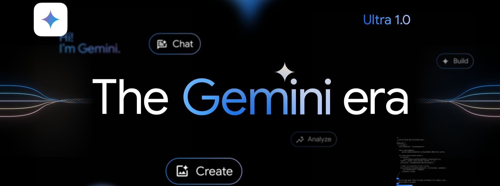

# Google Gemini PHP API
------
> [!IMPORTANT]
> **This library is an independent creation. It is neither endorsed nor an officially recognized library for interacting with the Google Gemini API. And please, if you decide to use it, make sure to guard your Service or OAuth 2.0 account credentials json file.**

[Gemini](https://deepmind.google/technologies/gemini/) is Google's largest and most capable AI model. This library contains all the info you need to start building applications with Gemini through the API. It is intended to give you access to the latest API features & capabilities.
## Table of Contents
- [Prerequisites](#prerequisites)
  - [Dependencies](#dependencies)
  - [Set up your API Key](#set-up-your-api-key)
  - [Set Up Service Account or OAuth 2.0](#set-up-service-account-or-oauth-20)
- [Installation](#installation)
  - [Environment Variables](#environment-variables)
  - [Basic Usage with Proxy](#basic-usage-with-proxy)
  - [Basic Usage with Service Account Credentials](#basic-usage-with-service-account-credentials)
  - [Basic Usage with OAuth 2.0 Credentials](#basic-usage-with-oauth-20-credentials)
  - [Basic Usage with Proxy + One of the Credentials](#basic-usage-with-proxy--one-of-the-credentials)
  - [Override Endpoints](#override-endpoints)
- [Models Resource](#models-resource)
  - [Get Model](#get-model)
  - [List Models](#list-models)
- [Chat Resource](#chat-resource)
  - [System Instruction](#system-instruction)
  - [Text-only Input](#text-only-input)
  - [Text and Image Input](#text-and-image-input)
  - [Text and Images Input](#text-and-images-input)
  - [Text and Local + Uploaded File Inputs](#text-and-local--uploaded-file-inputs)
  - [Multi-turn Conversations (Chat)](#multi-turn-conversations-chat)
  - [Stream Generated Content](#stream-generated-content)
  - [Count Tokens](#count-tokens)
- [Function Calling](#function-calling)
  - [Single Turn Call](#single-turn-call)
  - [Submit Tool Output (Multi-turn)](#submit-tool-output)
  - [Single Turn Call with Mode](#single-turn-call-with-mode)
  - [Multiple Multi-turns Call](#multiple-multi-turns-call)
- [Embeddings Resource](#embeddings-resource)
  - [Embed Contents](#embed-contents)
  - [Batch Embed Contents](#batch-embed-contents)
  - [Output Dimensionality](#output-dimensionality)
  - [Use-case Hinting](#use-case-hinting)
- [Model Tuning Resource](#model-tuning-resource)
  - [List Tuned Models](#list-tuned-models)
  - [Get Tuned Model](#get-tuned-model)
  - [Create Tuned Model](#create-tuned-model)
  - [Get Tuning State](#get-tuning-state)
  - [Generate Content](#generate-content)
  - [Delete Tuned Model](#delete-tuned-model)
  - [Transfer Ownership](#transfer-ownership)
- [Files Resource](#files--media-resource)
  - [Upload File](#upload-file)
  - [List Files](#list-files)
  - [Get File](#get-file)
  - [Delete File](#delete-file)
  - [Chat with File](#chat-with-file)
- [Tests](#tests)

## Prerequisites
> [!NOTE]
> **If you do not have the service accounts or OAuth 2.0 credentials you'll only work with endpoints that only need your API Key.**
### Dependencies
1. PHP 8.1+
2. [Composer](https://getcomposer.org/)
3. ~~[PHP-FFMpeg](https://github.com/PHP-FFMpeg/PHP-FFMpeg) (for Video Frames). It's included with this lib, but read the notice below~~

> ~~**ATTENTION!** *PHP-FFMpeg requires a working [FFMpeg install](https://ffmpeg.org/download.html). You will need both FFMpeg and FFProbe binaries to use it. Be sure that these binaries can be located with system PATH to get the benefit of the binary detection, otherwise you should have to explicitly give the binaries path on load.*~~

### Set up your API Key
To use the Gemini API, you'll need an API key. If you don't already have one, create a key in Google AI Studio. [Get an API Key](https://aistudio.google.com/app/apikey)

### Set Up Service Account or OAuth 2.0
You only need one of the following, so choose what you prefer to work with

<details>
<summary>Expand to Read Instructions</summary>
<br>

#### Set Up Service Account
1. Go to the [Google Developer Console](https://console.cloud.google.com/) and create a new project if you don't already have one.
2. In the navigation menu, select **APIs & Services > Credentials**.
3. Click on **Create credentials** and select **Service account**.
4. Enter a name for the service account and click **Create**.
5. Assign the necessary roles to your service account and click **Continue**.
6. Click on **Create Key**, choose the **JSON** key type, and click **Create**.
7. Your new public/private key pair will be downloaded to your computer; this is your service account key.
8. Securely store the JSON file containing the key, as it allows access to the Gemini API.

#### Set Up OAuth 2.0
1. In the [Google Developer Console](https://console.cloud.google.com/), select your project.
2. Navigate to **APIs & Services > Credentials** and click on **Create credentials**.
3. Choose **OAuth client ID**.
4. Configure your OAuth consent screen if prompted.
5. Select the application type for your project (e.g., Web application, Android, iOS).
6. Set up the authorized redirect URIs for your application.
7. Click **Create** and take note of your client ID and client secret.

#### Add Scopes to your Project
The endpoints that require Service Account or OAuth 2.0 also require your project to have the necessary scopes. If you haven't already done this or need to update your scopes:

1. In the [Google Developer Console](https://console.cloud.google.com/), select your project.
2. Navigate to **APIs & Services > OAuth consent screen** and for **User Type** choose  **External** and Create.
3. Fill in the App Information then proceed to the Scopes Tab.
4. Click **Add or Remove Scopes** then select the following or manually enter the URLs:
   - `https://www.googleapis.com/auth/generative-language`
   - `https://www.googleapis.com/auth/generative-language.tuning`
   - `https://www.googleapis.com/auth/generative-language.tuning.readonly`
   - `https://www.googleapis.com/auth/generative-language.retriever`
   - `https://www.googleapis.com/auth/generative-language.retriever.readonly`

You don't need all of them but maybe in the future you'll need to have those scopes so setting them all in advance might help.

5. Click **UPDATE** once done.

`https://www.googleapis.com/auth/generative-language.tuning` is hard-coded in this library so you'd probably use that as scope for your OAuth 2.0 authentication.

### Add Roles to your Service Account
Please ensure to add the neccessary roles to your service account during creation. At the time of writing this, no clue as to what roles should be given to the service account to interact with the Gemini API Authentication, giving it an Owner role is something `NOT RECOMMENDED` yet it's the only option that seemed to provide the shortcut. Create PR for this section if you know the appropriate roles to assign the service account.
</details>

## Installation

```shell
composer require derrickob/gemini-api
```

### Environment Variables
Set your environment variables:

*Powershell*

```powershell
$Env:GOOGLE_API_KEY = "AIza...."
```

*Cmd*

```cmd
set GOOGLE_API_KEY=AIza....
```

_Linux or macOS_

```shell
export GOOGLE_API_KEY=AIza....
```

### Basic Usage with Proxy
```php
<?php

require_once "vendor/autoload.php";

use Derrickob\GeminiApi\GeminiFactory;

$apiKey = getenv('GOOGLE_API_KEY');

// Basic proxy configuration 
$config = [
    'proxy' => 'http://proxy.example.com:8080',
];

// Advanced proxy configuration
$config = [
    'proxy' => [
        'http' => 'http://proxy.example.com:8080',
        'https' => 'https://proxy.example.com:8080',
        'no' => ['example.com'],
    ],
];

$gemini = GeminiFactory::create($apiKey, $config);

// you can now proceed with the examples
```

### Basic Usage with Service Account Credentials
```php
<?php

require_once "vendor/autoload.php";

use Derrickob\GeminiApi\GeminiFactory;

$apiKey = getenv('GOOGLE_API_KEY');

$config = [
    'auth' => [
        'type' => 'service',
        'projectid' => 'your-project-id',
        'credentials' => 'path/to/service-account-credentials.json',
    ],
];

$gemini = GeminiFactory::create($apiKey, $config);

// you can now proceed with the examples
```
### Basic Usage with OAuth 2.0 Credentials
Authenticate outside and provide the `refresh_token` with your OAuth 2.0 details. You can build a .json file like the valid service account or pass the details directly
```php
<?php

require_once "vendor/autoload.php";

use Derrickob\GeminiApi\GeminiFactory;

$apiKey = getenv('GOOGLE_API_KEY');

$config = [
    'auth' => [
        'type' => 'oauth',
        'projectid' => 'your-project-id',
        'credentials' => [
          'client_id' => 'your-client-id',
          'client_secret' => 'your-client-secret',
          'refresh_token' => 'your-obtained-refresh-token',
        ],
    ],
];

$gemini = GeminiFactory::create($apiKey, $config);

// you can now proceed with the examples
```
If you want to have your credentials in a .json, create the new .json file and fill in your credentials:
```json
{"client_id": "your-client-id", "client_secret": "your-client-secret", "refresh_token" : "your-obtained-refresh-token"}
```
Then you can pass in the OAuth 2.0 like so:
```php
$config = [
    'auth' => [
        'type' => 'oauth',
        'projectid' => 'your-project-id',
        'credentials' => 'path/to/your-oauth-file.json,
    ],
];
```
### Basic Usage with Proxy + One of the Credentials
You can use a proxy with one of the options of authentication depending on what you decided to work with
```php
<?php

require_once "vendor/autoload.php";

use Derrickob\GeminiApi\GeminiFactory;

$apiKey = getenv('GOOGLE_API_KEY');

// Basic proxy configuration 
$config = [
    'auth' => [
        'type' => 'service',
        'projectid' => 'your-project-id',
        'credentials' => 'path/to/service-account-credentials.json',
    ],
    'proxy' => 'http://proxy.example.com:8080',
];

// Advanced proxy configuration
$config = [
    'auth' => [
        'type' => 'service',
        'projectid' => 'your-project-id',
        'credentials' => 'path/to/service-account-credentials.json',
    ],
    'proxy' => [
        'http' => 'http://proxy.example.com:8080',
        'https' => 'https://proxy.example.com:8080',
        'no' => ['example.com'],
    ],
];

$gemini = GeminiFactory::create($apiKey, $config);

// you can now proceed with the examples
```
### Override Endpoints
By default the base uri is `https://generativelanguage.googleapis.com/` and API Version `v1beta` but you can override this as below (You can combine this to one of the basic usage configs covered above)
```php
<?php

require_once "vendor/autoload.php";

use Derrickob\GeminiApi\GeminiFactory;

$apiKey = getenv('GOOGLE_API_KEY');

$config = [
      'base_uri' => 'https://your-new-endpoint.com/',
      'api_version' => 'v1'
];

$gemini = GeminiFactory::create($apiKey, $config);

// you can now proceed with the examples
```

> 1. If you decide not to provide a Service Account file, or OAuth 2.0 file, or haven't set the appropriate scopes, or appropriate roles, you will be able to use the endpoints that ONLY work with your API Key
> 2. If you don't have the Service account or OAuth 2.0 credentials do not pass in the `$config` param to the Factory unless for proxy

Subsequent sections on this page don't include basic usage codes above.

## Models Resource
This section provides guides to dealing with the available Gemini Models in the API

### Get Model
Get information about a given model such as version, display name, input token limit, etc.

```php
$request = $gemini->retrieveModel('models/gemini-pro');

$res = json_decode($request);

$name = $res->name;
$v = $res->version;
$display_name = $res->displayName;
// etc
```
<details>
<summary>Sample Response Body</summary>
<br>

```php
{
  "name": "models/gemini-pro",
  "version": "001",
  "displayName": "Gemini 1.0 Pro",
  "description": "The best model for scaling across a wide range of tasks",
  "inputTokenLimit": 30720,
  "outputTokenLimit": 2048,
  "supportedGenerationMethods": [
    "generateContent",
    "countTokens"
  ],
  "temperature": 0.9,
  "topP": 1,
  "topK": 1
}
```
</details>

### List Models
Query for the list all of the models available through the API, including both the Gemini and PaLM family models.

```php
$request = $gemini->listModels();

// decode response
$res = json_decode($request);

foreach ($res->models as $model) {
    // $modal->name;
    // $modal->version;
    // $modal->displayName;
    // $modal->description;
    // etc

    echo $model->name.PHP_EOL;
}
```
<details>
<summary>Sample Response Body</summary>
<br>

```json
{
  "models": [
    {
      "name": "models/chat-bison-001",
      "version": "001",
      "displayName": "PaLM 2 Chat (Legacy)",
      "description": "A legacy text-only model optimized for chat conversations",
      "inputTokenLimit": 4096,
      "outputTokenLimit": 1024,
      "supportedGenerationMethods": [
        "generateMessage",
        "countMessageTokens"
      ],
      "temperature": 0.25,
      "topP": 0.95,
      "topK": 40
    },
    {
      "name": "models/text-bison-001",
      "version": "001",
      "displayName": "PaLM 2 (Legacy)",
      "description": "A legacy model that understands text and generates text as an output",
      "inputTokenLimit": 8196,
      "outputTokenLimit": 1024,
      "supportedGenerationMethods": [
        "generateText",
        "countTextTokens",
        "createTunedTextModel"
      ],
      "temperature": 0.7,
      "topP": 0.95,
      "topK": 40
    },
    {
      "name": "models/embedding-gecko-001",
      "version": "001",
      "displayName": "Embedding Gecko",
      "description": "Obtain a distributed representation of a text.",
      "inputTokenLimit": 1024,
      "outputTokenLimit": 1,
      "supportedGenerationMethods": [
        "embedText",
        "countTextTokens"
      ]
    },
    {
      "name": "models/gemini-1.0-pro",
      "version": "001",
      "displayName": "Gemini 1.0 Pro",
      "description": "The best model for scaling across a wide range of tasks",
      "inputTokenLimit": 30720,
      "outputTokenLimit": 2048,
      "supportedGenerationMethods": [
        "generateContent",
        "countTokens"
      ],
      "temperature": 0.9,
      "topP": 1,
      "topK": 1
    },
    {
      "name": "models/gemini-1.0-pro-001",
      "version": "001",
      "displayName": "Gemini 1.0 Pro 001 (Tuning)",
      "description": "The best model for scaling across a wide range of tasks. This is a stable model that supports tuning.",
      "inputTokenLimit": 30720,
      "outputTokenLimit": 2048,
      "supportedGenerationMethods": [
        "generateContent",
        "countTokens",
        "createTunedModel"
      ],
      "temperature": 0.9,
      "topP": 1,
      "topK": 1
    },
    {
      "name": "models/gemini-1.0-pro-latest",
      "version": "001",
      "displayName": "Gemini 1.0 Pro Latest",
      "description": "The best model for scaling across a wide range of tasks. This is the latest model.",
      "inputTokenLimit": 30720,
      "outputTokenLimit": 2048,
      "supportedGenerationMethods": [
        "generateContent",
        "countTokens"
      ],
      "temperature": 0.9,
      "topP": 1,
      "topK": 1
    },
    {
      "name": "models/gemini-1.0-pro-vision-latest",
      "version": "001",
      "displayName": "Gemini 1.0 Pro Vision",
      "description": "The best image understanding model to handle a broad range of applications",
      "inputTokenLimit": 12288,
      "outputTokenLimit": 4096,
      "supportedGenerationMethods": [
        "generateContent",
        "countTokens"
      ],
      "temperature": 0.4,
      "topP": 1,
      "topK": 32
    },
    {
      "name": "models/gemini-1.5-pro-latest",
      "version": "001",
      "displayName": "Gemini 1.5 Pro",
      "description": "Mid-size multimodal model that supports up to 1 million tokens",
      "inputTokenLimit": 1048576,
      "outputTokenLimit": 8192,
      "supportedGenerationMethods": [
        "generateContent",
        "countTokens"
      ],
      "temperature": 1,
      "topP": 0.95
    },
    {
      "name": "models/gemini-pro",
      "version": "001",
      "displayName": "Gemini 1.0 Pro",
      "description": "The best model for scaling across a wide range of tasks",
      "inputTokenLimit": 30720,
      "outputTokenLimit": 2048,
      "supportedGenerationMethods": [
        "generateContent",
        "countTokens"
      ],
      "temperature": 0.9,
      "topP": 1,
      "topK": 1
    },
    {
      "name": "models/gemini-pro-vision",
      "version": "001",
      "displayName": "Gemini 1.0 Pro Vision",
      "description": "The best image understanding model to handle a broad range of applications",
      "inputTokenLimit": 12288,
      "outputTokenLimit": 4096,
      "supportedGenerationMethods": [
        "generateContent",
        "countTokens"
      ],
      "temperature": 0.4,
      "topP": 1,
      "topK": 32
    },
    {
      "name": "models/embedding-001",
      "version": "001",
      "displayName": "Embedding 001",
      "description": "Obtain a distributed representation of a text.",
      "inputTokenLimit": 2048,
      "outputTokenLimit": 1,
      "supportedGenerationMethods": [
        "embedContent"
      ]
    },
    {
      "name": "models/text-embedding-004",
      "version": "004",
      "displayName": "Text Embedding 004",
      "description": "Obtain a distributed representation of a text.",
      "inputTokenLimit": 2048,
      "outputTokenLimit": 1,
      "supportedGenerationMethods": [
        "embedContent"
      ]
    },
    {
      "name": "models/aqa",
      "version": "001",
      "displayName": "Model that performs Attributed Question Answering.",
      "description": "Model trained to return answers to questions that are grounded in provided sources, along with estimating answerable probability.",
      "inputTokenLimit": 7168,
      "outputTokenLimit": 1024,
      "supportedGenerationMethods": [
        "generateAnswer"
      ],
      "temperature": 0.2,
      "topP": 1,
      "topK": 40
    }
  ]
}
```
</details>


## Chat resource
### System Instruction
System instructions enable users to steer the behavior of the model based on their specific needs and use cases. When you set a system instruction, you give the model additional context to understand the task, provide more customized responses, and adhere to specific guidelines over the full user interaction with the model
> **NOTES:**
> 1. At the time of writing this, _System Instruction_ is only available for the `gemini-1.5-pro-latest` model
> 2. System instructions can help guide the model to follow instructions, but they don't fully prevent jailbreaks or leaks. Google recommends exercising caution around putting any sensitive information in system instructions.
```php
$responses = $gemini->generateContent('models/gemini-1.5-pro-latest', [
    "system_instruction" => [
        "parts" => [
            "text" => "You are Neko the cat respond like one"
        ]
    ],
    'contents' => [
        [
            'parts' => [
                [
                    'text' => 'Hello there'
                ]
            ]
        ]
    ]
]);

// print_r($responses);
$res = json_decode($responses);

echo $res->candidates[0]->content->parts[0]->text;
```
<details>
<summary>Sample Response Body</summary>
<br>

```json
{
  "candidates": [
    {
      "content": {
        "parts": [
          {
            "text": "*purrs* Mrow? \n"
          }
        ],
        "role": "model"
      },
      "finishReason": "STOP",
      "index": 0,
      "safetyRatings": [
        {
          "category": "HARM_CATEGORY_SEXUALLY_EXPLICIT",
          "probability": "NEGLIGIBLE"
        },
        {
          "category": "HARM_CATEGORY_HATE_SPEECH",
          "probability": "NEGLIGIBLE"
        },
        {
          "category": "HARM_CATEGORY_HARASSMENT",
          "probability": "NEGLIGIBLE"
        },
        {
          "category": "HARM_CATEGORY_DANGEROUS_CONTENT",
          "probability": "NEGLIGIBLE"
        }
      ]
    }
  ]
}
```
</details>

Subsequent examples don't have system instruction included. You may want to include it if you're using `gemini-1.5-pro-latest` to make a request.

### Text-only Input
Generate a response from the model given an input message. If the input contains only text, use the `gemini-pro` model.

```php
$response = $gemini->generateContent('models/gemini-pro', [
    'contents' => [
        [
            'parts' => [
                [
                    'text' => 'Write a story about a magic backpack'
                ]
            ]
        ]
    ]
]);

// decode the response
$res = json_decode($response);
//Get text
echo $res->candidates[0]->content->parts[0]->text;

```
<details>
<summary>Sample Response Body</summary>
<br>

```json
{
  "candidates": [
    {
      "content": {
        "parts": [
          {
            "text": "In the quaint little town of Everw..."
          }
        ],
        "role": "model"
      },
      "finishReason": "STOP",
      "index": 0,
      "safetyRatings": [
        {
          "category": "HARM_CATEGORY_SEXUALLY_EXPLICIT",
          "probability": "NEGLIGIBLE"
        },
        {
          "category": "HARM_CATEGORY_HATE_SPEECH",
          "probability": "NEGLIGIBLE"
        },
        {
          "category": "HARM_CATEGORY_HARASSMENT",
          "probability": "NEGLIGIBLE"
        },
        {
          "category": "HARM_CATEGORY_DANGEROUS_CONTENT",
          "probability": "NEGLIGIBLE"
        }
      ]
    }
  ]
}
```
</details>

### Text and Image Input
If the input contains both text and image, use the `gemini-pro-vision` model.

```php
$response = $gemini->generateContent('models/gemini-pro-vision', [
    'contents' => [
        [
            'parts' => [
                [
                    'text' => 'What is this picture?'
                ],
                [
                    'inline_data' => [
                        'mime_type' => 'image/png',
                        'data' => base64_encode(file_get_contents('files/sample.png'))
                    ]
                ]
            ]
        ]
    ]
]);

// decode the response
$res = json_decode($response);
//Get text
echo $res->candidates[0]->content->parts[0]->text;

```
<details>
<summary>Sample Response Body</summary>
<br>

```php

{
  "candidates": [
    {
      "content": {
        "parts": [
          {
            "text": " The picture shows a table with a white tablecloth. On the table are two cups of coffee, a bowl of blueberries, a silver spoon, and some flowers. There are also some blueberry scones on the table. The background is a dark blue color."
          }
        ],
        "role": "model"
      },
      "finishReason": "STOP",
      "index": 0,
      "safetyRatings": [
        {
          "category": "HARM_CATEGORY_SEXUALLY_EXPLICIT",
          "probability": "NEGLIGIBLE"
        },
        {
          "category": "HARM_CATEGORY_HATE_SPEECH",
          "probability": "NEGLIGIBLE"
        },
        {
          "category": "HARM_CATEGORY_HARASSMENT",
          "probability": "NEGLIGIBLE"
        },
        {
          "category": "HARM_CATEGORY_DANGEROUS_CONTENT",
          "probability": "NEGLIGIBLE"
        }
      ]
    }
  ]
}
```
</details>

### Text and Images Input

Same as previous example, but passing more images to the model.

> Make sure you stay within the max limits for number of images you can pass to the model you're using
```php
$response = $gemini->generateContent('models/gemini-pro-vision', [
    'contents' => [
        [
            'parts' => [
                [
                    'text' => 'What do you see in these pictures?'
                ],
                [
                    'inline_data' => [
                        'mime_type' => 'image/png',
                        'data' => base64_encode(file_get_contents('files/sample.png'))
                    ]
                ],
                [
                    'inline_data' => [
                        'mime_type' => 'image/jpeg',
                        'data' => base64_encode(file_get_contents('files/sample.jpg'))
                    ]
                ]
            ]
        ]
    ]
]);
// decode the response
$res = json_decode($response);
//Get text
echo $res->candidates[0]->content->parts[0]->text;

```
<details>
<summary>Sample Response Body</summary>
<br>

```php

{
  "candidates": [
    {
      "content": {
        "parts": [
          {
            "text": " The first picture is of a table with a white tablecloth, on which are arranged several blueberry scones, a bowl of blueberries, two cups of coffee, a silver spoon, and some pink flowers. The second picture is of a scene from the movie \"Everything Everywhere All at Once\", in which three people are sitting in a room, wearing headphones and looking at a glowing egg."
          }
        ],
        "role": "model"
      },
      "finishReason": "STOP",
      "index": 0,
      "safetyRatings": [
        {
          "category": "HARM_CATEGORY_SEXUALLY_EXPLICIT",
          "probability": "NEGLIGIBLE"
        },
        {
          "category": "HARM_CATEGORY_HATE_SPEECH",
          "probability": "NEGLIGIBLE"
        },
        {
          "category": "HARM_CATEGORY_HARASSMENT",
          "probability": "NEGLIGIBLE"
        },
        {
          "category": "HARM_CATEGORY_DANGEROUS_CONTENT",
          "probability": "NEGLIGIBLE"
        }
      ]
    }
  ]
}
```
</details>

### Text and Local + Uploaded File Inputs
You can also include your local image file with the one you uploaded with the [Files API](#files--media-resource)
> Make sure you stay within the max limits for number of images you can pass to the model you're using
```php
$response = $gemini->generateContent('models/gemini-pro-vision', [
    'contents' => [
        [
            'parts' => [
                [
                    'text' => 'What do you see in these pictures?'
                ],
                [
                    'inline_data' => [
                        'mime_type' => 'image/png',
                        'data' => base64_encode(file_get_contents('files/sample.png'))
                    ]
                ],
                [
                    'file_data' => [
                        'mime_type' => 'image/jpeg',
                        'file_uri' => 'https://generativelanguage.googleapis.com/v1beta/files/rpdybdgwuk9k'
                    ]
                ]
            ]
        ]
    ]
]);
// decode the response
$res = json_decode($response);
//Get text
echo $res->candidates[0]->content->parts[0]->text;

```
<details>
<summary>Sample Response Body</summary>
<br>

```php
{
  "candidates": [
    {
      "content": {
        "parts": [
          {
            "text": " The first picture is of a table with a white tablecloth. On the table are two cups of coffee, a bowl of blueberries, a silver spoon, and five scones. The scones are covered in blueberries and have a crumbly texture. The table is also decorated with pink flowers.\n\nThe second picture is of a scene from the movie \"Everything Everywhere All at Once\". In the scene, three people are sitting in a room. The room is decorated in a futuristic style. The people are wearing headphones and are looking at a small, glowing object."
          }
        ],
        "role": "model"
      },
      "finishReason": "STOP",
      "index": 0,
      "safetyRatings": [
        {
          "category": "HARM_CATEGORY_SEXUALLY_EXPLICIT",
          "probability": "NEGLIGIBLE"
        },
        {
          "category": "HARM_CATEGORY_HATE_SPEECH",
          "probability": "NEGLIGIBLE"
        },
        {
          "category": "HARM_CATEGORY_HARASSMENT",
          "probability": "NEGLIGIBLE"
        },
        {
          "category": "HARM_CATEGORY_DANGEROUS_CONTENT",
          "probability": "NEGLIGIBLE"
        }
      ]
    }
  ]
}
```
</details>

### Multi-turn Conversations (Chat)
> **Note:** *The `gemini-pro-vision` model (for text-and-image input) is not yet optimized for multi-turn conversations. Make sure to use `gemini-pro` and text-only input for chat use cases.*
```php
$response = $gemini->generateContent('models/gemini-pro', [
    'contents' => [
        [
            [
                'role' => 'user',
                'parts' => [
                    [
                        'text' => 'Write the first line of a story about a magic backpack.'
                    ]
                ]
            ],
            [
                'role' => 'model',
                'parts' => [
                    [
                        'text' => 'In the bustling city of Meadow brook, lived a young girl named Sophie. She was a bright and curious soul with an imaginative mind.'
                    ]
                ]
            ],
            [
                'role' => 'user',
                'parts' => [
                    [
                        'text' => 'Can you set it in a quiet village in 1600s France?'
                    ]
                ]
            ]

        ]
    ]
]);
// decode the response
$res = json_decode($response);
//Get text
echo $res->candidates[0]->content->parts[0]->text;

```
<details>
<summary>Sample Response Body</summary>
<br>

```php
{
  "candidates": [
    {
      "content": {
        "parts": [
          {
            "text": "In the tranquil village of Fleur-de-Lys, nestled amidst the rolling hills of 17th century France, resided a young maiden named Antoinette.\n\n**OR**\n\nAmidst the cobblestone streets and half-timbered houses of Fleur-de-Lys, a quiet village in 1600s France, there lived a young girl named Antoinette."
          }
        ],
        "role": "model"
      },
      "finishReason": "STOP",
      "index": 0,
      "safetyRatings": [
        {
          "category": "HARM_CATEGORY_SEXUALLY_EXPLICIT",
          "probability": "NEGLIGIBLE"
        },
        {
          "category": "HARM_CATEGORY_HATE_SPEECH",
          "probability": "NEGLIGIBLE"
        },
        {
          "category": "HARM_CATEGORY_HARASSMENT",
          "probability": "NEGLIGIBLE"
        },
        {
          "category": "HARM_CATEGORY_DANGEROUS_CONTENT",
          "probability": "NEGLIGIBLE"
        }
      ]
    }
  ]
}
```
</details>

### Stream Generated Content
By default, a response is returned after completing the entire generation process. You can achieve faster interactions by not waiting for the entire result, and instead return partial results.

```php
$data = [
    'contents' => [
        [
            'parts' => [
                [
                    'text' => 'Write long a story about a magic backpack.'
                ]
            ]
        ]
    ]
];

foreach ($gemini->streamGenerateContent('models/gemini-pro', $data) as $response) {
    // may need to handle instances where the model doesn't contain text body (safety, refusal, etc)
    echo $response->candidates[0]->content->parts[0]->text;
    // print_r($response)
}
```
<details>
<summary>Sample Response Body</summary>
<br>

```php
stdClass Object
(
    [candidates] => Array
        (
            [0] => stdClass Object
                (
                    [content] => stdClass Object
                        (
                            [parts] => Array
                                (
                                    [0] => stdClass Object
                                        (
                                            [text] => In the quaint town of Willow Creek, nestled amidst rolling hills and whispering willows,
                                        )

                                )

                            [role] => model
                        )

                    [finishReason] => STOP
                    [index] => 0
                    [safetyRatings] => Array
                        (
                            [0] => stdClass Object
                                (
                                    [category] => HARM_CATEGORY_SEXUALLY_EXPLICIT
                                    [probability] => NEGLIGIBLE
                                )

                            [1] => stdClass Object
                                (
                                    [category] => HARM_CATEGORY_HATE_SPEECH
                                    [probability] => NEGLIGIBLE
                                )

                            [2] => stdClass Object
                                (
                                    [category] => HARM_CATEGORY_HARASSMENT
                                    [probability] => NEGLIGIBLE
                                )

                            [3] => stdClass Object
                                (
                                    [category] => HARM_CATEGORY_DANGEROUS_CONTENT
                                    [probability] => NEGLIGIBLE
                                )

                        )

                )

        )

)
// etc
```
</details>

### Count Tokens
When using long prompts, it might be useful to count tokens before sending any content to the model.

```php
$response = $gemini->countTokens('models/gemini-pro', [
    'contents' => [
        [
            'parts' => [
                [
                    'text' => 'Just trying to count the number of tokens in this sentence'
                ]
            ]
        ]
    ]
]);

$res = json_decode($response);
$total = $res->totalTokens;
```
<details>
<summary>Sample Response Body</summary>
<br>

```json
{
  "totalTokens": 11
}
```
</details>

## Function Calling
Function calling lets you create a description of a function in your code, then pass the description to the API in a request. The response from the model includes the name of a function that matches the description and the arguments to call it with. It lets you use functions as tools, and you can define more than one function within a single request.

### Single Turn Call
Single-turn is when you call the language model one time. With function calling, a single-turn use case might be when you provide the model a natural language query and a list of functions. In this case, the model uses the function declaration, which includes the function name, parameters, and description, to predict which function to call and the arguments to call it with.

```php
// Please copy this $tools variable for use in  other examples as it hasn't been included to minimize README page length
$tools = [
    [
        "name" => "find_movies",
        "description" => "find movie titles currently playing in theaters based on any description, genre, title words, etc.",
        "parameters" => [
            "type" => "object",
            "properties" => [
                "location" => [
                    "type" => "string",
                    "description" => "The city and state, e.g. San Francisco, CA or a zip code e.g. 95616"
                ],
                "description" => [
                    "type" => "string",
                    "description" => "Any kind of description including category or genre, title words, attributes, etc."
                ]
            ],
            "required" => [
                "description"
            ]
        ]
    ],
    [
        "name" => "find_theaters",
        "description" => "find theaters based on location and optionally movie title which are is currently playing in theaters",
        "parameters" => [
            "type" => "object",
            "properties" => [
                "location" => [
                    "type" => "string",
                    "description" => "The city and state, e.g. San Francisco, CA or a zip code e.g. 95616"
                ],
                "movie" => [
                    "type" => "string",
                    "description" => "Any movie title"
                ]
            ],
            "required" => [
                "location"
            ]
        ]
    ],
    [
        "name" => "get_showtimes",
        "description" => "Find the start times for movies playing in a specific theater",
        "parameters" => [
            "type" => "object",
            "properties" => [
                "location" => [
                    "type" => "string",
                    "description" => "The city and state, e.g. San Francisco, CA or a zip code e.g. 95616"
                ],
                "movie" => [
                    "type" => "string",
                    "description" => "Any movie title"
                ],
                "theater" => [
                    "type" => "string",
                    "description" => "Name of the theater"
                ],
                "date" => [
                    "type" => "string",
                    "description" => "Date for requested showtime"
                ]
            ],
            "required" => [
                "location",
                "movie",
                "theater",
                "date"
            ]
        ]
    ]
];


$response = $gemini->generateContent("models/gemini-pro", [
    "contents" => [
        "role" => "user",
        "parts" => [
            "text" => "Which theaters in Mountain View show Barbie movie?"
        ]
    ],
    "tools" => [
        [
            "function_declarations" => $tools
        ]
    ]
]);

$res = json_decode($response);

// if response contains tool output
// at time of writing this, Gemini returns only one tool output
$tool_outputs = $res->candidates[0]->content->parts[0]->functionCall;

$tool_name = $tool_outputs->name;
$tool_args = $tool_outputs->args;
foreach($tool_args as $arg){
    $args[] = $arg;
}
echo "The API called {$tool_name}  with arguments: ".implode(', ',$args);

```
<details>
<summary>Sample Response Body</summary>
<br>

```json
{
  "candidates": [
    {
      "content": {
        "parts": [
          {
            "functionCall": {
              "name": "find_theaters",
              "args": {
                "movie": "Barbie",
                "location": "Mountain View, CA"
              }
            }
          }
        ],
        "role": "model"
      },
      "finishReason": "STOP",
      "index": 0,
      "safetyRatings": [
        {
          "category": "HARM_CATEGORY_HARASSMENT",
          "probability": "NEGLIGIBLE"
        },
        {
          "category": "HARM_CATEGORY_HATE_SPEECH",
          "probability": "NEGLIGIBLE"
        },
        {
          "category": "HARM_CATEGORY_DANGEROUS_CONTENT",
          "probability": "NEGLIGIBLE"
        },
        {
          "category": "HARM_CATEGORY_SEXUALLY_EXPLICIT",
          "probability": "NEGLIGIBLE"
        }
      ]
    }
  ]
}
```
</details>

### Submit Tool Output
We're using the example response from the previous turn:

```json
"functionCall": {
  "name": "find_theaters",
  "args": {
    "movie": "Barbie",
    "location": "Mountain View, CA"
  }
}
```
Submitting the Tool Output

```php
// $tools = [ --- ] // Copy tools arrays from single turn call example.

$response = $gemini->generateContent("models/gemini-pro", [
    "contents" => [
        [
            "role" => "user",
            "parts" => [
                [
                    "text" => "Which theaters in Mountain View show Barbie movie?"
                ]
            ]
        ],
        [
            "role" => "model",
            "parts" => [
                [
                    "functionCall" => [
                        "name" => "find_theaters",
                        "args" => [
                            "location" => "Mountain View, CA",
                            "movie" => "Barbie"
                        ]
                    ]
                ]
            ]
        ],
        [
            "role" => "function",
            "parts" => [
                [
                    "functionResponse" => [
                        "name" => "find_theaters",
                        "response" => [
                            "name" => "find_theaters",
                            "content" => [
                                "movie" => "Barbie",
                                "theaters" => [
                                    [
                                        "name" => "AMC Mountain View 16",
                                        "address" => "2000 W El Camino Real, Mountain View, CA 94040"
                                    ],
                                    [
                                        "name" => "Regal Edwards 14",
                                        "address" => "245 Castro St, Mountain View, CA 94040"
                                    ]
                                ]
                            ]
                        ]
                    ]
                ]
            ]
        ]
    ],
    "tools" => [
        [
            "function_declarations" => $tools
        ]
    ]
]);
print_r($response);
$res = json_decode($response);

echo $res->candidates[0]->content->parts[0]->text;
```
<details>
<summary>Sample Response Body</summary>
<br>

```json
{
  "candidates": [
    {
      "content": {
        "parts": [
          {
            "text": "Two theaters in Mountain View are showing the movie Barbie: AMC Mountain View 16 and Regal Edwards 14."
          }
        ],
        "role": "model"
      },
      "finishReason": "STOP",
      "index": 0,
      "safetyRatings": [
        {
          "category": "HARM_CATEGORY_SEXUALLY_EXPLICIT",
          "probability": "NEGLIGIBLE"
        },
        {
          "category": "HARM_CATEGORY_HATE_SPEECH",
          "probability": "NEGLIGIBLE"
        },
        {
          "category": "HARM_CATEGORY_HARASSMENT",
          "probability": "NEGLIGIBLE"
        },
        {
          "category": "HARM_CATEGORY_DANGEROUS_CONTENT",
          "probability": "NEGLIGIBLE"
        }
      ]
    }
  ]
}
```
</details>

### Single Turn Call with Mode
You can use the function calling mode to define the execution behavior for function calling. There are three modes available:
- `AUTO`: The default model behavior. The model decides to predict either a function call or a natural language response.
- `ANY`: The model is constrained to always predict a function call. If `allowed_function_names` is not provided, the model picks from all of the available function declarations. If `allowed_function_names` is provided, the model picks from the set of allowed functions.
- `NONE`: The model won't predict a function call. In this case, the model behavior is the same as if you don't pass any function declarations.
<br>
<details>
<summary>Read More</summary>
<br>

You can also pass a set of `allowed_function_names` that, when provided, limits the functions that the model will call. You should only include `allowed_function_names` when the mode is `ANY`. Function names should match function declaration names. With the mode set to `ANY` and the `allowed_function_names` set, the model will predict a function call from the set of function names provided.
</details>

Here's part of an example request that sets the mode to `ANY` and specifies a list of allowed functions:

```php
"tool_config" => [
    "function_calling_config" => [
      "mode" => "ANY",
      "allowed_function_names" => ["find_theaters","get_showtimes"]
    ]
  ]
```
The following example is similar to the [Single Turn Call Example](#single-turn-call), but it sets the mode to `ANY`:
```php
// $tools = [ --- ] // Copy tools arrays from single turn call example.

$response = $gemini->generateContent("models/gemini-pro", [
    "contents" => [
        "role" => "user",
        "parts" => [
            "text" => "Which theaters in Mountain View show Barbie movie?"
        ]
    ],
    "tools" => [
        [
            "function_declarations" => $tools
        ]
    ],
    "tool_config" => [
    "function_calling_config" => [
      "mode" => "ANY"
    ]
  ]
]);

$res = json_decode($response);

// if response contains tool output
// at time of writing this, Gemini returns only one tool output
$tool_outputs = $res->candidates[0]->content->parts[0]->functionCall;

$tool_name = $tool_outputs->name;
$tool_args = $tool_outputs->args;
foreach($tool_args as $arg){
    $args[] = $arg;
}
echo "The API called {$tool_name}  with arguments: ".implode(', ',$args);

```
<details>
<summary>Sample Response Body</summary>
<br>

```json
{
  "candidates": [
    {
      "content": {
        "parts": [
          {
            "functionCall": {
              "name": "find_theaters",
              "args": {
                "movie": "Barbie",
                "location": "Mountain View, CA"
              }
            }
          }
        ],
        "role": "model"
      },
      "finishReason": "STOP",
      "index": 0,
      "safetyRatings": [
        {
          "category": "HARM_CATEGORY_SEXUALLY_EXPLICIT",
          "probability": "NEGLIGIBLE"
        },
        {
          "category": "HARM_CATEGORY_HATE_SPEECH",
          "probability": "NEGLIGIBLE"
        },
        {
          "category": "HARM_CATEGORY_DANGEROUS_CONTENT",
          "probability": "NEGLIGIBLE"
        },
        {
          "category": "HARM_CATEGORY_HARASSMENT",
          "probability": "NEGLIGIBLE"
        }
      ]
    }
  ]
}
```
</details>

### Multiple Multi-turns Call
The following example calls the language model multiple times to call a function. Each time the model calls the function, it can use a different function to answer a different user query in the request.

```php
// $tools = [ --- ] // Copy tools arrays from single turn call example.

$response = $gemini->generateContent("models/gemini-pro", [
    "contents" => [
        [
            "role" => "user",
            "parts" => [
                [
                    "text" => "Which theaters in Mountain View show Barbie movie?"
                ]
            ]
        ],
        [
            "role" => "model",
            "parts" => [
                [
                    "functionCall" => [
                        "name" => "find_theaters",
                        "args" => [
                            "location" => "Mountain View, CA",
                            "movie" => "Barbie"
                        ]
                    ]
                ]
            ]
        ],
        [
            "role" => "function",
            "parts" => [
                [
                    "functionResponse" => [
                        "name" => "find_theaters",
                        "response" => [
                            "name" => "find_theaters",
                            "content" => [
                                "movie" => "Barbie",
                                "theaters" => [
                                    [
                                        "name" => "AMC Mountain View 16",
                                        "address" => "2000 W El Camino Real, Mountain View, CA 94040"
                                    ],
                                    [
                                        "name" => "Regal Edwards 14",
                                        "address" => "245 Castro St, Mountain View, CA 94040"
                                    ]
                                ]
                            ]
                        ]
                    ]
                ]
            ]
        ],
        [
            "role" => "model",
            "parts" => [
                [
                    "text" => "OK. Barbie is showing in two theaters in Mountain View, CA: AMC Mountain View 16 and Regal Edwards 14."
                ]
            ]
        ],
        [
            "role" => "user",
            "parts" => [
                [
                    "text" => "Can we recommend some comedy movies on show in Mountain View?"
                ]
            ]
        ]
    ],
    "tools" => [
        [
            "function_declarations" => $tools
        ]
    ]
]);


print_r($response);
$res = json_decode($response);

// if response contains tool output
// at time of writing this, Gemini returns only one tool output
$tool_outputs = $res->candidates[0]->content->parts[0]->functionCall;

$tool_name = $tool_outputs->name;
$tool_args = $tool_outputs->args;
foreach($tool_args as $arg){
    $args[] = $arg;
}
echo "The API called {$tool_name}  with arguments: ".implode(', ',$args);

```

## Embeddings Resource
The embedding service in the Gemini API generates state-of-the-art embeddings for words, phrases, and sentences. The resulting embeddings can then be used for NLP tasks, such as semantic search, text classification and clustering among many others. This section show-cases how to create them.

### Embed Contents
Generate an embedding from the model given an input
```php
$responses = $gemini->embedContents('models/text-embedding-004', [
    'model' => 'models/text-embedding-004',
    'content' => 
        [
            'parts' => [
                [
                    'text' => 'Hello world'
                ]
            ]
        ]
]);

// print_r($responses);
$res = json_decode($responses);

$embeddings = $res->embedding->values;
print_r($embeddings);
```
<details>
<summary>Sample Response Body</summary>
<br>

```json
{
  "embedding": {
    "values": [
      0.013168523,
      -0.008711934,
      0.04019695,
      // --
    ]
  }
}
```
</details>

### Batch Embed Contents
You can embed a list of multiple prompts with one API call for efficiency.
```php
$responses = $gemini->batchEmbedContents('models/text-embedding-004', [
        'requests' => [
            [
                'model' => 'models/text-embedding-004',
                'content' => [
                    'parts' => [
                        [
                            'text' => 'What is the meaning of life?'
                        ]
                    ]
                ]
            ],
            [
                'model' => 'models/text-embedding-004',
                'content' => [
                    'parts' => [
                        [
                            'text' => 'How much wood would a woodchuck chuck?'
                        ]
                    ]
                ]
            ],
            [
                'model' => 'models/text-embedding-004',
                'content' => [
                    'parts' => [
                        [
                            'text' => 'How does the brain work?'
                        ]
                    ]
                ]
            ]
        ]
]);

// print_r($responses);
$res = json_decode($responses);

$embeddings = $res->embeddings;

foreach ($embeddings as $embedding){
    $v = $embedding->values;
}
```
<details>
<summary>Sample Response Body</summary>
<br>

```json
{
  "embeddings": [
    {
      "values": [
        -0.010632277,
        // --
        -0.028534694
      ]
    },
    {
      "values": [
        0.018467998,
        // --
        0.0018762538
      ]
    },
    {
      "values": [
        0.05808907,
        // --
        -0.04440443
        ]
    }
  ]
}
```
</details>

### Output Dimensionality
If you're using `text-embeddings-004`, you can set the `output_dimensionality` paramater to create smaller embeddings.
> `output_dimensionality` truncates the embedding (e.g., `[1, 3, 5]` becomes `[1,3]` when `output_dimensionality=2`).
```php
$responses = $gemini->embedContents('models/text-embedding-004', [
    'model' => 'models/text-embedding-004',
    'output_dimensionality' => 256,
    'content' => 
        [
            'parts' => [
                [
                    'text' => 'Hello world'
                ]
            ]
        ]
]);

// print_r($responses);
$res = json_decode($responses);

$embeddings = $res->embedding->values;
print_r($embeddings);
```
<details>
<summary>Sample Response Body</summary>
<br>

```json
{
  "embedding": {
    "values": [
      0.013168523,
      0.060103577,
      // --
    ]
  }
}
```
</details>

### Use-case Hinting
Use `task_type` to provide a hint to the model how you'll use the embeddings. It is an optional parameter that provides a hint to the API about how you intend to use the embeddings in your application.

<details>
<summary>Expand to Read Documentation</summary>
<br>

> - `model`: Required. Must be `models/embedding-001`.
> - `content`: Required. The content that you would like to embed.
> - `task_type`: Optional. The task type for which the embeddings will be used. See below for possible values.
> - `title`: The given text is a document from a corpus being searched. Optionally, set the title parameter with the title of the document. Can only be set when `task_type` is `RETRIEVAL_DOCUMENT`.

The following `task_type` parameters are accepted:
> - `TASK_TYPE_UNSPECIFIED`: If you do not set the value, it will default to retrieval_query.
> - `RETRIEVAL_QUERY` : The given text is a query in a search/retrieval setting.
> - `RETRIEVAL_DOCUMENT`: The given text is a document from athe corpus being searched.
> - `SEMANTIC_SIMILARITY`: The given text will be used for Semantic Textual Similarity (STS).
> - `CLASSIFICATION`: The given text will be classified.
> - `CLUSTERING`: The embeddings will be used for clustering.
</details>
<br>

```php
$responses = $gemini->embedContents('models/embedding-001', [
    'model' => 'models/text-embedding-004',
    'content' =>
    [
        'parts' => [
            [
                'text' => 'Hello world'
            ]
        ]
    ],
    'task_type' => 'RETRIEVAL_DOCUMENT',
    'title' => 'My title'
]);

// print_r($responses);
$res = json_decode($responses);

$embeddings = $res->embedding->values;
print_r($embeddings);
```
<details>
<summary>Sample Response Body</summary>
<br>

```json
{
  "embedding": {
    "values": [
      0.060187872,
      0.035636507,
      // etc
    ]
  }
}
```
</details>

## Model Tuning Resource
Use model tuning to improve a model's performance on specific tasks or help the model adhere to specific output requirements when instructions aren't sufficient and you have a set of examples that demonstrate the outputs you want.
> **Note:** Tuning is available for the `gemini-1.0-pro-001` and `text-bison-001` models.

### List Tuned Models
Lists tuned models owned by the user.
```php

/*
$request = $gemini->listTunedModels([
  'page_size' => 20,
  'filter' => 'owner:me',
  'page_token' => 'the-next-page-string'
]);
*/

$request = $gemini->listTunedModels();

// print_r($request);
$tunedModels = json_decode($request);

foreach ($tunedModels as $model) {
    $model->name;
    $model->baseModel;
    $model->displayName;
    $model->state;
    // etc
}
```
<details>
<summary>Sample Response Body</summary>
<br>

```json
{
  "tunedModels": [
    {
      "name": "tunedModels/number-generator-model-9ua8fyi32qx",
      "baseModel": "models/gemini-1.0-pro-001",
      "displayName": "number generator model",
      "state": "ACTIVE",
      "createTime": "2024-04-14T12:14:39.204025Z",
      "updateTime": "2024-04-14T12:15:01.271699Z",
      "tuningTask": {
        "startTime": "2024-04-14T12:14:39.469211863Z",
        "completeTime": "2024-04-14T12:15:01.271699Z",
        "snapshots": [
          {
            "step": 1,
            "meanLoss": 11.499258,
            "computeTime": "2024-04-14T12:14:40.350245632Z"
          },
          {
            "step": 2,
            "meanLoss": 13.745591,
            "computeTime": "2024-04-14T12:14:40.813240064Z"
          },
          // --
        ],
        "hyperparameters": {
          "epochCount": 5,
          "batchSize": 2,
          "learningRate": 0.001
        }
      },
      "temperature": 0.9,
      "topP": 1,
      "topK": 1
    },
    {
      "name": "tunedModels/number-generator-100-7gs9fa0sjx6i",
      "baseModel": "models/gemini-1.0-pro-001",
      "displayName": "Number Generator 100",
      "state": "ACTIVE",
      "createTime": "2024-04-16T16:44:00.470390Z",
      "updateTime": "2024-04-16T16:44:28.871233Z",
      "tuningTask": {
        "startTime": "2024-04-16T16:44:02.649978713Z",
        "completeTime": "2024-04-16T16:44:28.871233Z",
        "snapshots": [
          {
            "step": 1,
            "meanLoss": 11.499258,
            "computeTime": "2024-04-16T16:44:04.280815837Z"
          },
          {
            "step": 2,
            "meanLoss": 13.782991,
            "computeTime": "2024-04-16T16:44:04.788885337Z"
          },
          // --
        ],
        "hyperparameters": {
          "epochCount": 5,
          "batchSize": 2,
          "learningRate": 0.001
        }
      },
      "temperature": 0.9,
      "topP": 1,
      "topK": 1
    }
  ]
}
```
</details>

### Get Tuned Model
Gets information about a specific TunedModel.
```php

$request = $gemini->retrieveModel('tunedModels/number-generator-100-7gs9fa0sjx6i');

// print_r($request);

$tunedModel = json_decode($request);

// results
$tunedModel->name;
$tunedModel->baseModel;
$tunedModel->displayName;
$tunedModel->state;
// etc
```
<details>
<summary>Sample Response Body</summary>
<br>

```json
{
  "name": "tunedModels/number-generator-100-7gs9fa0sjx6i",
  "baseModel": "models/gemini-1.0-pro-001",
  "displayName": "Number Generator 100",
  "state": "ACTIVE",
  "createTime": "2024-04-16T16:44:00.470390Z",
  "updateTime": "2024-04-16T16:44:28.871233Z",
  "tuningTask": {
    "startTime": "2024-04-16T16:44:02.649978713Z",
    "completeTime": "2024-04-16T16:44:28.871233Z",
    "snapshots": [
      {
        "step": 1,
        "meanLoss": 11.499258,
        "computeTime": "2024-04-16T16:44:04.280815837Z"
      },
      {
        "step": 2,
        "meanLoss": 13.782991,
        "computeTime": "2024-04-16T16:44:04.788885337Z"
      }
      // --
    ],
    "hyperparameters": {
      "epochCount": 5,
      "batchSize": 2,
      "learningRate": 0.001
    }
  },
  "temperature": 0.9,
  "topP": 1,
  "topK": 1
}
```
</details>

### Create Tuned Model
To create a tuned model, you need to pass your dataset to the model in the `training_data` field.

```php
$training_data = [
    [
        "text_input" => "1",
        "output" => "2"
    ],
    [
        "text_input" => "3",
        "output" => "4"
    ],
    [
        "text_input" => "-3",
        "output" => "-2"
    ],
    [
        "text_input" => "twenty two",
        "output" => "twenty three"
    ],
    [
        "text_input" => "two hundred",
        "output" => "two hundred one"
    ],
    [
        "text_input" => "ninety nine",
        "output" => "one hundred"
    ],
    [
        "text_input" => "8",
        "output" => "9"
    ],
    [
        "text_input" => "-98",
        "output" => "-97"
    ],
    [
        "text_input" => "1,000",
        "output" => "1,001"
    ],
    [
        "text_input" => "10,100,000",
        "output" => "10,100,001"
    ],
    [
        "text_input" => "thirteen",
        "output" => "fourteen"
    ],
    [
        "text_input" => "eighty",
        "output" => "eighty one"
    ],
    [
        "text_input" => "one",
        "output" => "two"
    ],
    [
        "text_input" => "three",
        "output" => "four"
    ],
    [
        "text_input" => "seven",
        "output" => "eight"
    ]
];

$request = $gemini->createTunedModel(
    [
        "display_name" => "Number Generator 100",
        "base_model" => "models/gemini-1.0-pro-001",
        "tuning_task" => [
            "hyperparameters" => [
                "batch_size" => 2,
                "learning_rate" => 0.001,
                "epoch_count" => 5
            ],
            "training_data" => [
                "examples" => [
                    "examples" => $training_data
                ]
            ]
        ]
    ]
);

print_r($request);
```
<details>
<summary>Sample Response Body</summary>
<br>

```json
{
  "name": "tunedModels/number-generator-100-7gs9fa0sjx6i/operations/9z8phaegycw6",
  "metadata": {
    "@type": "type.googleapis.com/google.ai.generativelanguage.v1beta.CreateTunedModelMetadata",
    "totalSteps": 38,
    "tunedModel": "tunedModels/number-generator-100-7gs9fa0sjx6i"
  }
}
```
</details>

### Get Tuning State
> Same as [Get Tuned Model](#get-tuned-model)

You can check the progress of your tuning job by checking the state field. `CREATING` means the tuning job is still ongoing and `ACTIVE` means the training is complete and the tuned model is ready to use.
```php
$request = $gemini->retrieveModel('tunedModels/number-generator-100-7gs9fa0sjx6i');

// print_r($request);

$tunedModel = json_decode($request);

//state
$tunedModel->state;
// etc
```
<details>
<summary>Sample Response Body</summary>
<br>

```json
{
  "name": "tunedModels/number-generator-model-9ua8fyi32qx",
  "baseModel": "models/gemini-1.0-pro-001",
  "displayName": "number generator model",
  "state": "ACTIVE",
  "createTime": "2024-04-14T12:14:39.204025Z",
  "updateTime": "2024-04-14T12:15:01.271699Z",
  "tuningTask": {
    "startTime": "2024-04-14T12:14:39.469211863Z",
    "completeTime": "2024-04-14T12:15:01.271699Z",
    "snapshots": [
      {
        "step": 1,
        "meanLoss": 11.499258,
        "computeTime": "2024-04-14T12:14:40.350245632Z"
      },
      {
        "step": 2,
        "meanLoss": 13.745591,
        "computeTime": "2024-04-14T12:14:40.813240064Z"
      }
      // --
    ],
    "hyperparameters": {
      "epochCount": 5,
      "batchSize": 2,
      "learningRate": 0.001
    }
  },
  "temperature": 0.9,
  "topP": 1,
  "topK": 1
}
```
</details>

### Generate Content
Generates a response from the tuned model given an input
```php

$response = $gemini->generateContent('tunedModels/number-generator-model-9ua8fyi32qx', [
    'contents' => [
        [
            'parts' => [
                [
                    'text' => '100'
                ]
            ]
        ]
    ]
]);

// print_r($response);
$res = json_decode($response);
echo $res->candidates[0]->content->parts[0]->text;
```
<details>
<summary>Sample Response Body</summary>
<br>

```json
{
  "candidates": [
    {
      "content": {
        "parts": [
          {
            "text": "101"
          }
        ],
        "role": "model"
      },
      "finishReason": "STOP",
      "index": 0,
      "safetyRatings": [
        {
          "category": "HARM_CATEGORY_SEXUALLY_EXPLICIT",
          "probability": "NEGLIGIBLE"
        },
        {
          "category": "HARM_CATEGORY_HATE_SPEECH",
          "probability": "NEGLIGIBLE"
        },
        {
          "category": "HARM_CATEGORY_HARASSMENT",
          "probability": "NEGLIGIBLE"
        },
        {
          "category": "HARM_CATEGORY_DANGEROUS_CONTENT",
          "probability": "NEGLIGIBLE"
        }
      ]
    }
  ]
}
```
</details>

### Delete Tuned Model
Deletes a tuned model.

```php
$response = $gemini->deleteTunedModel('tunedModels/number-generator-model-9ua8fyi32qx');

// If successful, the response body is empty.
print_r($response);
```
<details>
<summary>Sample Response Body</summary>
<br>

```json
{}
```
</details>

### Transfer Ownership
Transfers ownership of the tuned model. This is the only way to change ownership of the tuned model. The current owner will be downgraded to writer role.
```php
$response = $gemini->transferOwnership('tunedModels/number-generator-model-9ua8fyi32qx', [
  'email_address' => 'the-email@example.com'
]);

// If successful, the response body is empty.
print_r($response);
```
> On testing I kept getting: `You need to be the owner of the resource to transfer ownership` . Create PR if you find working method

## Files & Media Resource
You can upload files to quickly experiment with your own data. For example, you can upload ~~video or~~ image files, audio to use with the Files API, or upload a text file to read in with a long context model like Gemini 1.5 Pro
### Upload File
> Certain file types have their own way of uploading which might not work with this section, eg Video Upload
> 
Upload a local file
```php
$response = $gemini->uploadFile('files/sample.png',[
    'display_name' => "Sample PNG File",
]);

print_r($response);
$res = json_decode($response);

// $res->file->name;
// $res->file->displayName;
// $res->file->uri;
// etc

echo $res->file->name;
```
<details>
<summary>Sample Response Body</summary>
<br>

```json
{
  "file": {
    "name": "files/kcd5e450ydqv",
    "displayName": "Sample PNG File",
    "mimeType": "image/png",
    "sizeBytes": "357556",
    "createTime": "2024-04-18T10:03:14.333195Z",
    "updateTime": "2024-04-18T10:03:14.333195Z",
    "expirationTime": "2024-04-20T10:03:14.317762621Z",
    "sha256Hash": "NmI4NmM3MjU3MzNjOTJhNDE5YjQwMDFkZDJiM2RkMDc2NzA2ZDMxNGFkOTQyZjJjZmYyNGY3YzlkYjcyY2FjZQ==",
    "uri": "https://generativelanguage.googleapis.com/v1beta/files/kcd5e450ydqv"
  }
}
```
</details>

### List Files
Lists the metadata for files owned by the requesting project.
```php
/*
$response = $gemini->listFiles([
    'page_size' => 3,
    'page_token' => 'ciEKD4IBDAjN3IOxBhDg7pGqAgoOQgxnbTZiNjlyM3puY2w'
]);
*/

$response = $gemini->listFiles();

$res = json_decode($response);

$files = $res->files;

foreach($files as $file){
    // $file->name;
    // $file->uri;
    // etc
}
```

<details>
<summary>Sample Response Body</summary>
<br>

```json
{
  "files": [
    {
      "name": "files/5vc3vpss4mj1",
      "displayName": "Sample JPG File",
      "mimeType": "image/jpeg",
      "sizeBytes": "44485",
      "createTime": "2024-04-18T10:26:50.431199Z",
      "updateTime": "2024-04-18T10:26:50.431199Z",
      "expirationTime": "2024-04-20T10:26:50.419245361Z",
      "sha256Hash": "NTZhZGZiMDUzMzMxNmRhZjQ0M2Y3NjE0OWM2NGExZWUyYjdiZWUyMmFmYTBhMTQ0MjU5NzE4NzEzN2MxODQ0MQ==",
      "uri": "https://generativelanguage.googleapis.com/v1beta/files/5vc3vpss4mj1"
    },
    {
      "name": "files/welmj2l0d491",
      "displayName": "Song File",
      "mimeType": "audio/mpeg",
      "sizeBytes": "3235977",
      "createTime": "2024-04-18T10:13:48.560439Z",
      "updateTime": "2024-04-18T10:13:48.560439Z",
      "expirationTime": "2024-04-20T10:13:48.544708169Z",
      "sha256Hash": "Mjk1MjlkMDBkNjY5NTQ3MGM4MjQ2MGI1ZGJlMGQxN2YxNWEwMDdhODk2YjM2NzJjMTgwNmYxZWVmZDJjMWIwNw==",
      "uri": "https://generativelanguage.googleapis.com/v1beta/files/welmj2l0d491"
    }
    {
      "name": "files/gm6b69r3zncl",
      "displayName": "Sample File",
      "mimeType": "image/png",
      "sizeBytes": "357556",
      "createTime": "2024-04-18T09:56:29.625244Z",
      "updateTime": "2024-04-18T09:56:29.625244Z",
      "expirationTime": "2024-04-20T09:56:29.609170495Z",
      "sha256Hash": "NmI4NmM3MjU3MzNjOTJhNDE5YjQwMDFkZDJiM2RkMDc2NzA2ZDMxNGFkOTQyZjJjZmYyNGY3YzlkYjcyY2FjZQ==",
      "uri": "https://generativelanguage.googleapis.com/v1beta/files/gm6b69r3zncl"
    }
  ],
  "nextPageToken": "ciEKD4IBDAjN3IOxBhDg7pGqAgoOQgxnbTZiNjlyM3puY2w"
}
```
</details>

### Get File
Gets the metadata for the given file.
```php
$response = $gemini->retrieveFile('files/welmj2l0d491');

// print_r($response);

$res = json_decode($response);

// $res->name;
// $res->uri;
// etc
```
<details>
<summary>Sample Response Body</summary>
<br>

```json
{
  "name": "files/welmj2l0d491",
  "displayName": "Song File",
  "mimeType": "audio/mpeg",
  "sizeBytes": "3235977",
  "createTime": "2024-04-18T10:13:48.560439Z",
  "updateTime": "2024-04-18T10:13:48.560439Z",
  "expirationTime": "2024-04-20T10:13:48.544708169Z",
  "sha256Hash": "Mjk1MjlkMDBkNjY5NTQ3MGM4MjQ2MGI1ZGJlMGQxN2YxNWEwMDdhODk2YjM2NzJjMTgwNmYxZWVmZDJjMWIwNw==",
  "uri": "https://generativelanguage.googleapis.com/v1beta/files/welmj2l0d491"
}
```
</details>

### Delete File
Delete an uploaded file.
```php
$response = $gemini->deleteFile('files/welmj2l0d491');

// If successful, the response body is empty.
print_r($response);
```
<details>
<summary>Sample Response Body</summary>
<br>

```json
{}
```
</details>

### Chat with File
Sample way to chat with a file you uploaded. Be sure you've passed in the correct mime type of the file and that it hasn't expired already

```php
$response = $gemini->generateContent('models/gemini-pro-vision', [
    'contents' => [
        [
            'parts' => [
                [
                    'text' => 'Describe what you see in this picture'
                ],
                [
                    'file_data' => [
                        'mime_type' => 'image/jpeg',
                        'file_uri' => 'https://generativelanguage.googleapis.com/v1beta/files/5d6ob4zt8gz9'
                    ]
                ]
            ]
        ]
    ]
]);

// print_r($response);
$res = json_decode($response);

echo $res->candidates[0]->content->parts[0]->text;
```

<details>
<summary>Sample Response Body</summary>
<br>

```json
{
  "candidates": [
    {
      "content": {
        "parts": [
          {
            "text": " This is an image from the movie \"The Adam Project\". In the picture, there are three people in a room with curved walls and soft pink lighting. There is a man and a woman sitting on a couch, and another woman standing. They are all wearing casual clothes and the man and woman on the couch are both wearing headphones. In the center of the room is a small, glowing orb."
          }
        ],
        "role": "model"
      },
      "finishReason": "STOP",
      "index": 0,
      "safetyRatings": [
        {
          "category": "HARM_CATEGORY_SEXUALLY_EXPLICIT",
          "probability": "NEGLIGIBLE"
        },
        {
          "category": "HARM_CATEGORY_HATE_SPEECH",
          "probability": "NEGLIGIBLE"
        },
        {
          "category": "HARM_CATEGORY_HARASSMENT",
          "probability": "NEGLIGIBLE"
        },
        {
          "category": "HARM_CATEGORY_DANGEROUS_CONTENT",
          "probability": "NEGLIGIBLE"
        }
      ]
    }
  ]
}
```
</details>

## Tests
```php
composer unit-test
```
or 
```php
phpunit tests
```